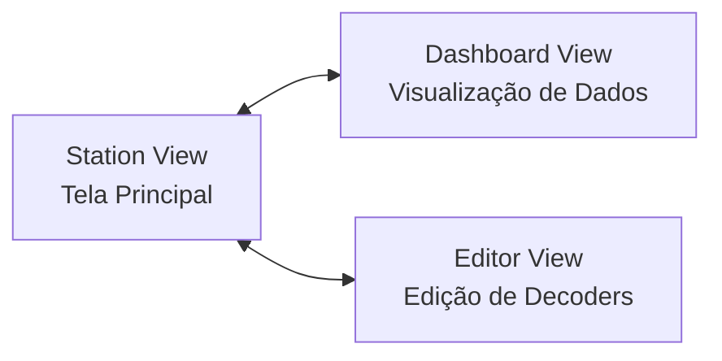
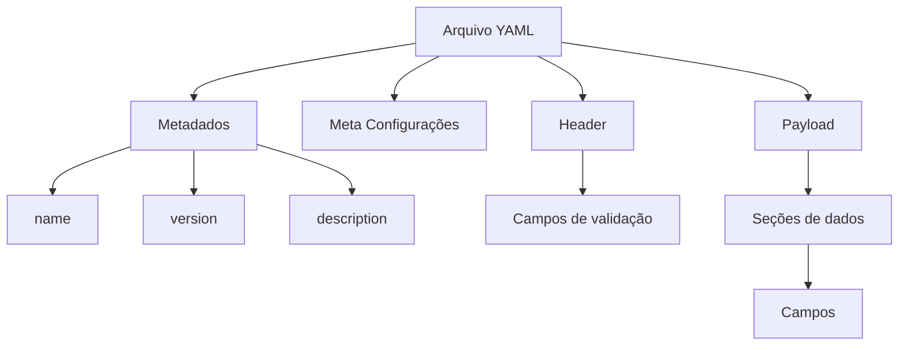
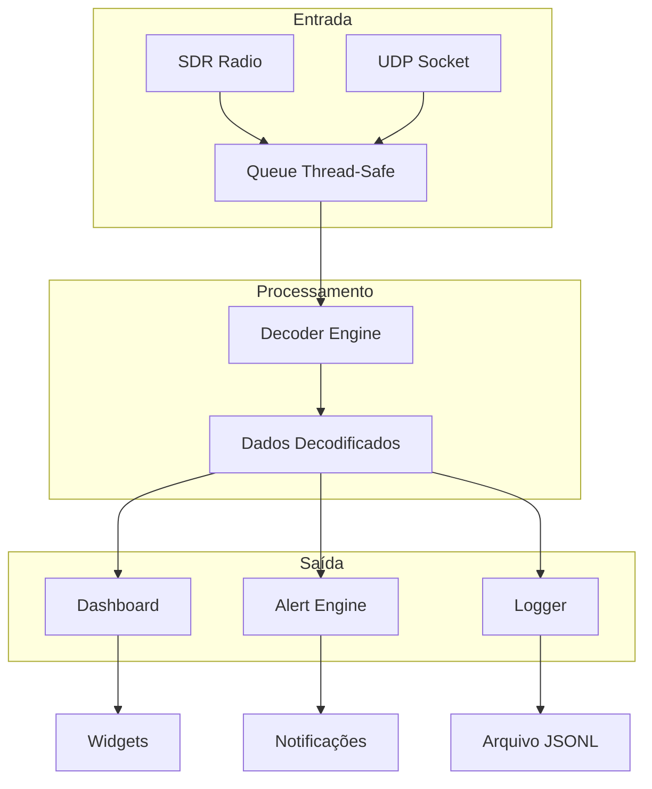
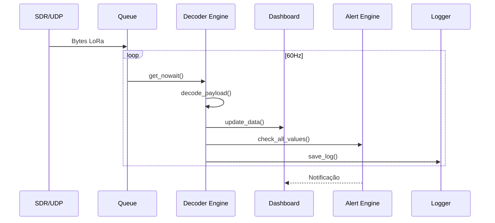

# NPA Ground Station - Manual do Usuário

<p align="center">
  
</p>

<p align="center">
  <strong>Sistema de Estação Terrestre para Telemetria LoRa</strong><br>
  Versão 5.6 | NPA-UFG
</p>

---

## Índice

1. [Introdução](#1-introdução)
2. [Instalação](#2-instalação)
3. [Visão Geral da Interface](#3-visão-geral-da-interface)
4. [Tela Principal - Station View](#4-tela-principal---station-view)
5. [Dashboard de Telemetria](#5-dashboard-de-telemetria)
6. [Editor de Decoders](#6-editor-de-decoders)
7. [Sistema de Alertas](#7-sistema-de-alertas)
8. [Exportação de Dados](#8-exportação-de-dados)
9. [Geração de Relatórios](#9-geração-de-relatórios)
10. [Histórico e Filtros](#10-histórico-e-filtros)
11. [Configuração de Decoders YAML](#11-configuração-de-decoders-yaml)
12. [Ferramentas CLI](#12-ferramentas-cli)
13. [Solução de Problemas](#13-solução-de-problemas)
14. [Referência Técnica](#14-referência-técnica)

---

## 1. Introdução

### 1.1 Sobre o Sistema

O NPA Ground Station é um software de estação terrestre desenvolvido pela NPA-UFG para receber, decodificar e visualizar dados de telemetria transmitidos via protocolo LoRa. O sistema foi projetado para operação com satélites, CubeSats e dispositivos IoT que utilizam modulação LoRa para comunicação.

### 1.2 Protocolo LoRa

O sistema opera exclusivamente com o protocolo LoRa (Long Range), uma tecnologia de modulação de espectro espalhado que oferece:

- Comunicação de longo alcance (até centenas de quilômetros em linha de visada)
- Alta resistência a interferências
- Baixo consumo de energia
- Configuração flexível de Spreading Factor (SF7-SF12) e Bandwidth

### 1.3 Funcionalidades Principais

| Funcionalidade | Descrição |
|----------------|-----------|
| Recepção Multi-modo | SDR Radio ou UDP Network |
| Dashboard Interativo | Gráficos, mapas, gauges e indicadores |
| Mapa GPS em Tempo Real | Trajetória e posição atual |
| Sistema de Alertas | Notificações configuráveis por campo |
| Exportação Flexível | Formatos CSV e JSON com filtros |
| Relatórios PDF | Geração de relatórios profissionais com gráficos e mapas |
| Decoders Customizáveis | Configuração via arquivos YAML |
| Multi-Decoder | Seleção automática ou múltipla de decoders |
| Histórico de Dados | Carregamento e análise de sessões anteriores |

### 1.4 Modos de Operação

O sistema suporta dois modos de recepção de dados LoRa:

**Modo SDR Radio**: Conexão direta com dispositivos SDR (RTL-SDR, HackRF, Airspy) para recepção de sinais LoRa via GNU Radio.

**Modo UDP Network**: Recebimento de pacotes LoRa através da rede, útil para integração com gateways LoRa externos ou para testes e simulação.

---

## 2. Instalação

### 2.1 Requisitos do Sistema

| Requisito | Especificação |
|-----------|---------------|
| Sistema Operacional | Linux (Arch Linux, Ubuntu, Debian) |
| Python | 3.10 ou superior |
| Memória RAM | Mínimo 4GB, recomendado 8GB |
| Hardware Opcional | RTL-SDR, HackRF ou Airspy |

### 2.2 Instalação via pip

```bash
# Clone o repositório
git clone https://github.com/npa-ufg/npags.git
cd npags

# Crie um ambiente virtual (recomendado)
python -m venv venv
source venv/bin/activate

# Instale as dependências
pip install -e .
```

### 2.3 Dependências Opcionais

```bash
# Para geração de relatórios PDF com mapas
pip install reportlab matplotlib py-staticmaps

# Ou instale todas as dependências de relatórios
pip install -e ".[reports]"

# Para suporte a SDR com GNU Radio
# Arch Linux
sudo pacman -S gnuradio gr-osmosdr

# Ubuntu/Debian
sudo apt install gnuradio gr-osmosdr
```

### 2.4 Executando o Software

```bash
# Ative o ambiente virtual
source venv/bin/activate

# Execute a aplicação (via entry point - recomendado)
npags-gui

# Ou diretamente via módulo Python
python -m npags.gui.main_window
```

**Entry Points Disponíveis:**

| Comando | Descrição |
|---------|-----------|
| `npags-gui` | Interface gráfica principal |
| `npags-radio` | Backend de rádio (modo headless) |

---

## 3. Visão Geral da Interface

### 3.1 Estrutura de Navegação

O NPA Ground Station possui três telas principais organizadas em um sistema de navegação por pilha (stack).



### 3.2 Descrição das Telas

| Tela | Função | Acesso |
|------|--------|--------|
| Station View | Configuração e controle principal do sistema | Tela inicial |
| Dashboard View | Visualização de dados em tempo real | Botão "DASHBOARD" |
| Editor View | Criação e edição de decoders YAML | Botões "Novo" ou "Editar" |

---

## 4. Tela Principal - Station View

A Station View é a interface inicial do sistema, responsável pela configuração dos parâmetros de recepção LoRa e controle do sistema.

### 4.1 Visão Geral


<!-- Captura de tela completa da Station View mostrando sidebar e área principal -->

### 4.2 Sidebar de Configuração

A sidebar lateral esquerda contém todos os controles de configuração do sistema.

#### 4.2.1 Seletor de Modo de Operação

Permite alternar entre os modos SDR Radio e UDP Network.


<!-- Captura do seletor de modo com os botões SDR Radio e UDP Network -->

#### 4.2.2 Parâmetros SDR Radio

Configurações disponíveis quando o modo SDR Radio está selecionado:

| Parâmetro | Descrição | Valores Típicos |
|-----------|-----------|-----------------|
| Dispositivo SDR | Rádio SDR conectado | RTL-SDR, HackRF, Airspy |
| Frequência (MHz) | Frequência central de recepção LoRa | 915.0, 868.0, 433.0 |
| Spreading Factor | Fator de espalhamento LoRa | 7 a 12 |
| Bandwidth (Hz) | Largura de banda LoRa | 125000, 250000, 500000 |
| Ganho RF (dB) | Ganho do receptor | 0 a 49 |
| Bias Tee | Alimentação para LNA externo | Ativado/Desativado |


#### 4.2.3 Parâmetros UDP Network

Configurações disponíveis quando o modo UDP Network está selecionado:

| Parâmetro | Descrição | Valor Padrão |
|-----------|-----------|--------------|
| Host / IP | Endereço para escuta | 0.0.0.0 |
| Porta UDP | Porta de recepção | 5005 |


#### 4.2.4 Seletor de Decoder

Permite selecionar o perfil de decoder para interpretação dos pacotes LoRa recebidos. O sistema suporta **seleção múltipla de decoders** para operação com Multi-Decoder.


| Elemento | Função |
|----------|--------|
| Lista de Decoders | Seleção única ou múltipla de decoders ativos |
| Botão "Novo" | Abre o editor para criar novo decoder |
| Botão "Editar" | Abre o editor com o decoder selecionado |

**Modo Multi-Decoder:**

Quando múltiplos decoders são selecionados, o sistema utiliza o `MultiDecoderEngine` que:

- Seleciona automaticamente o decoder mais apropriado baseado no tamanho do payload
- Verifica sync_word e constraints de tamanho (`min_size`/`max_size`)
- Tenta todos os decoders em caso de falha na seleção automática
- Retorna o decoder que conseguiu decodificar com sucesso

#### 4.2.5 Botões de Ação


| Botão | Função |
|-------|--------|
| DASHBOARD | Navega para a tela de visualização de dados |
| INICIAR | Inicia a recepção de dados LoRa |
| PARAR | Interrompe a recepção (exibido durante operação) |

### 4.3 Área Principal

#### 4.3.1 Waterfall (Espectro de RF)

O waterfall exibe o espectro de radiofrequência em tempo real, disponível apenas no modo SDR Radio.


| Eixo | Representação |
|------|---------------|
| Horizontal | Frequência |
| Vertical | Tempo (mais recente na parte inferior) |
| Cor | Intensidade do sinal (escuro = fraco, claro = forte) |

#### 4.3.2 Log de Telemetria

Exibe os pacotes LoRa recebidos e decodificados em formato textual.


Formato das mensagens de log:

| Campo | Descrição |
|-------|-----------|
| Timestamp | Horário de recepção (HH:MM:SS) |
| PKT # | Número sequencial do pacote |
| Tamanho | Tamanho do pacote em bytes |
| Dados | Campos decodificados com valores |

### 4.4 Procedimento de Operação

#### 4.4.1 Iniciando a Recepção

1. Selecione o modo de operação (SDR Radio ou UDP Network)
2. Configure os parâmetros correspondentes ao modo selecionado
3. Selecione o decoder apropriado para o dispositivo transmissor
4. Clique no botão "INICIAR"
5. Observe o log de telemetria para confirmar recepção de pacotes

#### 4.4.2 Parando a Recepção

1. Clique no botão "PARAR"
2. Aguarde a confirmação no log de sistema
3. Um resumo da sessão será exibido com estatísticas

---

## 5. Dashboard de Telemetria

O Dashboard é a interface de visualização de dados em tempo real, construída dinamicamente com base no decoder selecionado.

### 5.1 Visão Geral


### 5.2 Barra Superior

A barra superior do dashboard contém controles de navegação e ações.


| Elemento | Função |
|----------|--------|
| Botão "Voltar" | Retorna à tela principal |
| Título da Missão | Nome do decoder/missão atual |
| Status de Recepção | Tempo desde o último pacote recebido |
| Botão "Filtro / Histórico" | Abre diálogo de carregamento de dados históricos |
| Botão "Salvar Layout" | Persiste a organização atual dos widgets |
| Botão "Exportar" | Abre diálogo de exportação de dados |
| Botão "Alertas" | Abre configuração do sistema de alertas |

### 5.3 Tipos de Widgets

O dashboard suporta diversos tipos de widgets para visualização de dados. O tipo de widget é definido no arquivo YAML do decoder através da propriedade `widget`.

#### 5.3.1 Plot (Gráfico de Linha)

Exibe o histórico de valores de um campo em formato de gráfico de linha interativo.


**Interações disponíveis:**

| Ação | Resultado |
|------|-----------|
| Movimento do mouse | Crosshair exibe valor do ponto |
| Clique esquerdo | Fixa um ponto com marcador |
| Clique direito | Copia valor para área de transferência |
| Scroll do mouse | Zoom in/out |
| Arrastar | Pan (deslocamento da visualização) |
| Botão "Reset Zoom" | Restaura visualização automática |

**Configuração YAML:**
```yaml
- name: "temperature"
  type: "int16be"
  scale: 0.1
  unit: "C"
  widget: "plot"
  plot_color: "#FF5555"
```

#### 5.3.2 Gauge (Medidor)

Exibe um valor numérico com barra de progresso, ideal para valores percentuais ou com faixa definida.


**Configuração YAML:**
```yaml
- name: "battery"
  type: "uint8"
  unit: "%"
  widget: "gauge"
  min: 0
  max: 100
```

#### 5.3.3 Card (Cartão)

Exibe um valor simples com unidade, adequado para leituras pontuais.


**Configuração YAML:**
```yaml
- name: "latitude"
  type: "int32be"
  scale: 0.0000001
  unit: "deg"
  widget: "card"
  format: "{:.6f}"
```

#### 5.3.4 LED (Indicador de Status)

Exibe um indicador colorido com mapeamento de valores para estados textuais.


**Configuração YAML:**
```yaml
- name: "system_status"
  type: "uint8"
  widget: "led"
  mapping:
    0: "NOMINAL"
    1: "ALERTA"
    2: "CRITICO"
  colors:
    0: "#00FF00"
    1: "#FFAA00"
    2: "#FF0000"
```

#### 5.3.5 Map (Mapa GPS)

Exibe um mapa interativo com trajetória e posição atual do dispositivo.


**Elementos do mapa:**

| Elemento | Descrição |
|----------|-----------|
| Marcador verde | Ponto inicial da trajetória |
| Marcador vermelho | Posição atual (com animação de pulso) |
| Linha de trajetória | Caminho percorrido |
| Painel de informações | Contagem de pontos e distância total |

**Configuração YAML:**
```yaml
- name: "gps_map"
  type: "virtual"
  widget: "map"
  lat_source: "latitude"
  lon_source: "longitude"
```

#### 5.3.6 Vario (Variometro)

Exibe indicador de velocidade vertical com setas direcionais coloridas.


**Configuração YAML:**
```yaml
- name: "vertical_speed"
  type: "int16be"
  scale: 0.1
  unit: "m/s"
  widget: "vario"
```

#### 5.3.7 Compass (Bussola)

Exibe indicador de direção com ponto cardinal e valor em graus.


**Configuração YAML:**
```yaml
- name: "heading"
  type: "uint16be"
  unit: "deg"
  widget: "compass"
```

### 5.4 Manipulação de Widgets

#### 5.4.1 Movendo Widgets

1. Posicione o cursor sobre a barra de título do widget
2. Clique e mantenha pressionado o botão esquerdo do mouse
3. Arraste para a posição desejada
4. Solte o botão do mouse

#### 5.4.2 Redimensionando Widgets

1. Posicione o cursor sobre a borda do widget
2. O cursor mudará para indicar redimensionamento
3. Clique e arraste para o tamanho desejado
4. Solte o botão do mouse

#### 5.4.3 Salvando Layout

1. Organize os widgets conforme desejado
2. Clique no botão "Salvar Layout" na barra superior
3. O layout será restaurado automaticamente na próxima sessão com o mesmo decoder

### 5.5 Filtro de Dispositivos

Para sistemas com múltiplos dispositivos (relay nodes), o dashboard permite filtrar dados por dispositivo.


**Procedimento:**

1. Localize o widget seletor de dispositivos (se disponível)
2. Clique no botão dropdown
3. Selecione "Todos" para visualizar todos os dispositivos ou selecione um dispositivo específico

---

## 6. Editor de Decoders

O Editor permite criar e modificar arquivos de configuração de decoder no formato YAML.

### 6.1 Acessando o Editor

**Para criar um novo decoder:**
1. Na tela principal, clique no botão "Novo" na seção de decoder
2. O editor será aberto em modo de criação

**Para editar um decoder existente:**
1. Selecione o decoder desejado no dropdown
2. Clique no botão "Editar"
3. O editor será aberto com o conteúdo do arquivo

### 6.2 Interface do Editor


### 6.3 Elementos da Interface

| Elemento | Função |
|----------|--------|
| Botão "Voltar" | Retorna à tela principal |
| Campo "Nome do Arquivo" | Define o nome do arquivo (apenas para novos decoders) |
| Área de edição | Editor de texto com syntax highlighting |
| Botão "Carregar Template" | Insere modelo básico de decoder |
| Botão "Validar Sintaxe" | Verifica erros de sintaxe YAML |
| Botão "Excluir Decoder" | Remove o decoder (apenas em modo de edição) |
| Botão "Salvar Decoder" | Salva o arquivo |

### 6.4 Syntax Highlighting

O editor possui destaque de sintaxe para YAML:

| Elemento | Cor |
|----------|-----|
| Chaves | Laranja |
| Comentários | Cinza itálico |
| Números | Laranja claro |

### 6.5 Validação de Sintaxe

Antes de salvar, utilize a função de validação:

1. Clique no botão "Validar Sintaxe"
2. Aguarde o resultado:
   - Sucesso: "Sintaxe YAML correta!"
   - Erro: Mensagem indicando a linha e tipo de erro


### 6.6 Template Padrao

O template padrão fornece uma estrutura básica para novos decoders:

```yaml
# Decoder Configuration
name: novo_decoder
version: "1.0"
description: "Descricao do decoder"

header:
  sync_word: 0xAA
  length_field: true

fields:
  - name: temperature
    type: int16
    unit: "C"
    scale: 0.1
    widget: gauge
    
  - name: humidity
    type: uint8
    unit: "%"
    widget: card
```

---

## 7. Sistema de Alertas

O sistema de alertas permite configurar notificações automáticas quando valores de telemetria ultrapassam limites definidos pelo usuário.

### 7.1 Acessando a Configuração

1. No Dashboard, clique no botão "Alertas" na barra superior
2. O diálogo de configuração será aberto


### 7.2 Diálogo de Configuração

O diálogo possui duas abas: Configuração e Histórico.


#### 7.2.1 Aba Configuração

Permite adicionar, editar e remover configurações de alertas.

**Tabela de alertas configurados:**

| Coluna | Descrição |
|--------|-----------|
| Campo | Nome do campo monitorado |
| Descrição | Descrição amigável do alerta |
| Mínimo | Valor mínimo (abaixo dispara alerta) |
| Máximo | Valor máximo (acima dispara alerta) |
| Severidade | Nível de criticidade |
| Ativo | Estado de ativação |

**Formulário de edição:**

| Campo | Descrição |
|-------|-----------|
| Campo | Seleção do campo de telemetria |
| Descrição | Texto descritivo do alerta |
| Valor Mínimo | Limite inferior (opcional) |
| Valor Máximo | Limite superior (opcional) |
| Severidade | Informação, Aviso ou Crítico |
| Tocar som | Habilita alerta sonoro |
| Alerta ativo | Habilita/desabilita o alerta |

#### 7.2.2 Aba Histórico

Exibe o registro de todos os alertas disparados durante a sessão.


| Coluna | Descrição |
|--------|-----------|
| Campo | Campo que disparou o alerta |
| Valor | Valor que causou a violação |
| Limite | Limite que foi ultrapassado |
| Severidade | Nível de criticidade |
| Horário | Momento do disparo |

### 7.3 Criando um Alerta

**Procedimento:**

1. Abra o diálogo de alertas
2. Na seção "Adicionar / Editar Alerta":
   - Selecione o campo no dropdown
   - Digite uma descrição (opcional)
   - Marque e defina o valor mínimo e/ou máximo
   - Selecione a severidade
   - Configure as opções de som e ativação
3. Clique no botão "Adicionar"


### 7.4 Níveis de Severidade

| Severidade | Descrição | Indicação Visual |
|------------|-----------|------------------|
| Informação | Apenas informativo | Borda azul |
| Aviso | Atenção necessária | Borda amarela |
| Crítico | Ação imediata requerida | Borda vermelha |

### 7.5 Notificações

Quando um alerta é disparado, uma notificação aparece no canto superior direito do dashboard.


**Comportamento das notificações:**

- Aparecem no canto superior direito
- Desaparecem automaticamente após 6 segundos
- Clique para fechar imediatamente
- Múltiplas notificações são empilhadas verticalmente
- A cor da borda indica a severidade

### 7.6 Indicador de Alertas Ativos

O botão "Alertas" na barra superior muda de cor quando há alertas ativos:

| Estado | Cor do Botão |
|--------|-------------|
| Sem alertas ativos | Cinza (padrão) |
| Alertas ativos | Vermelho |


### 7.7 Importação e Exportação

**Exportar configurações:**

1. Configure os alertas desejados
2. Clique no botão "Exportar"
3. Selecione o local e nome do arquivo JSON

**Importar configurações:**

1. Clique no botão "Importar"
2. Selecione um arquivo JSON de configuração
3. Os alertas serão carregados

---

## 8. Exportação de Dados

O sistema permite exportar dados de telemetria coletados para análise externa.

### 8.1 Acessando a Exportação

1. No Dashboard, clique no botão "Exportar" na barra superior
2. O diálogo de exportação será aberto

### 8.2 Diálogo de Exportação

O diálogo possui três abas para configuração detalhada.


#### 8.2.1 Aba Campos

Permite selecionar quais campos de telemetria serão exportados.


| Elemento | Função |
|----------|--------|
| Lista de campos | Seleção múltipla de campos |
| Botão "Selecionar Todos" | Marca todos os campos |
| Botão "Limpar Seleção" | Desmarca todos os campos |

#### 8.2.2 Aba Fontes

Permite selecionar as fontes de dados (dispositivos) e período.


| Elemento | Função |
|----------|--------|
| Lista de fontes | Seleção de dispositivos |
| Todos os dados | Exporta todo o buffer |
| Últimos N pontos | Limita quantidade de dados |

#### 8.2.3 Aba Formato

Permite configurar o formato de saída.


**Formato CSV:**

| Opção | Descrição |
|-------|-----------|
| Incluir cabeçalho | Nomes dos campos na primeira linha |
| Incluir metadados | Informações do decoder e data |
| Incluir coluna de índice | Numeração das linhas |
| Separador | Caractere separador (padrão: vírgula) |

**Formato JSON:**

| Opção | Descrição |
|-------|-----------|
| Formatação legível | Indentação para fácil leitura |
| Incluir configuração | Metadados dos campos |

### 8.3 Executando a Exportação

1. Configure campos, fontes e formato
2. Verifique o resumo na parte inferior do diálogo
3. Clique no botão "Exportar"
4. Selecione o local e nome do arquivo
5. Aguarde a confirmação de sucesso


### 8.4 Formato dos Arquivos Exportados

**Exemplo CSV:**
```csv
# Decoder: AgroSat-IoT
# Exportado em: 2024-01-15T14:32:00

index,temperature,pressure,altitude
0,23.5,1013.2,1250
1,23.6,1013.1,1248
2,23.7,1013.0,1245
```

**Exemplo JSON:**
```json
{
  "metadata": {
    "decoder": "AgroSat-IoT",
    "exported_at": "2024-01-15T14:32:00",
    "fields": ["temperature", "pressure", "altitude"]
  },
  "data": {
    "_satellite": {
      "temperature": [23.5, 23.6, 23.7],
      "pressure": [1013.2, 1013.1, 1013.0],
      "altitude": [1250, 1248, 1245]
    }
  }
}
```

---

## 9. Geração de Relatórios

O sistema permite gerar relatórios profissionais em PDF com análise completa dos dados de telemetria coletados.

### 9.1 Acessando o Gerador de Relatórios

1. No Dashboard, clique no botão "Relatório" na barra superior
2. O diálogo de geração de relatórios será aberto

> **Nota:** O gerador de relatórios é independente - você pode gerar relatórios mesmo sem uma sessão ativa, carregando dados do histórico.

### 9.2 Diálogo de Geração de Relatórios

O diálogo possui quatro abas para configuração detalhada.

#### 9.2.1 Aba Fonte de Dados

Permite selecionar o decoder e período dos dados.

| Elemento | Função |
|----------|--------|
| Decoder | Seleciona qual decoder será usado para interpretar os dados |
| Período | Define intervalo de tempo (De/Até) |
| Botões rápidos | Atalhos para períodos comuns (1h, 6h, 12h, 24h, 7d) |
| Botão "Carregar Dados" | Carrega dados do histórico para o período selecionado |
| Árvore de dados | Exibe dados carregados em estrutura hierárquica |

**Estrutura da Árvore de Dados:**

A árvore organiza os dados por fonte (dispositivo):

```
☑ Principal
  ☑ temperature (251 pontos)
  ☑ pressure (251 pontos)
  ☑ altitude (251 pontos)
☑ Node 1000
  ☑ humidity (45 pontos)
  ☑ soil_temp (45 pontos)
☑ Node 1001
  ...
```

Cada item pode ser marcado/desmarcado individualmente para incluir ou excluir do relatório.

#### 9.2.2 Aba Informações

Permite configurar metadados do relatório.

| Campo | Descrição |
|-------|-----------|
| Título do Relatório | Título que aparece na capa do PDF |
| Nome da Missão | Identificação da missão/operação |
| Autor | Nome do responsável pelo relatório |
| Organização | Nome da organização (opcional) |
| Tamanho da Página | A4 ou Carta (Letter) |
| Orientação | Retrato ou Paisagem |

#### 9.2.3 Aba Seções

Permite selecionar quais seções serão incluídas no relatório.

| Seção | Descrição |
|-------|-----------|
| Resumo Executivo | Visão geral da missão com métricas principais |
| Estatísticas de Telemetria | Tabela com min, max, média, desvio padrão, mediana |
| Gráficos Temporais | Gráficos de evolução dos dados ao longo do tempo |
| Registro de Alertas | Lista de alertas disparados durante a missão |
| Trajetória GPS (Mapa) | Mapa real com trajetória do dispositivo |
| Configuração e Metadados | Informações sobre a configuração do relatório |

**Estatísticas Disponíveis:**

| Estatística | Descrição |
|-------------|-----------|
| Contagem (N) | Número total de amostras |
| Mínimo | Menor valor registrado |
| Máximo | Maior valor registrado |
| Média | Valor médio |
| Desvio Padrão | Dispersão dos valores |
| Mediana | Valor central |

#### 9.2.4 Aba Gráficos

Permite configurar quais campos terão gráficos e o estilo visual.

**Seleção de Gráficos:**

Árvore similar à aba de dados, permitindo selecionar quais campos terão gráficos no relatório.

**Estilo dos Gráficos:**

| Estilo | Descrição |
|--------|-----------|
| Linha | Gráfico de linha contínua |
| Dispersão (Scatter) | Pontos individuais |
| Área | Linha com preenchimento |

**Qualidade:**

| Qualidade | DPI | Uso Recomendado |
|-----------|-----|------------------|
| Baixa | 72 | Visualização rápida, arquivo menor |
| Média | 100 | Uso geral (recomendado) |
| Alta | 150 | Impressão de alta qualidade |

### 9.3 Mapa de Trajetória GPS

Quando a opção "Trajetória GPS (Mapa)" está marcada e existem dados de latitude/longitude, o relatório inclui:

- **Mapa real do OpenStreetMap** com tiles baixados automaticamente
- **Linha de trajetória** em laranja sobre o mapa
- **Marcador de início** (círculo verde)
- **Marcador de fim** (círculo vermelho)
- **Tabela de estatísticas** com coordenadas e range

> **Nota:** O sistema busca automaticamente campos de GPS com nomes como `latitude`, `lat`, `gps_lat`, `longitude`, `lon`, `gps_lon`.

### 9.4 Gerando o Relatório

**Procedimento:**

1. Selecione o decoder na aba "Fonte de Dados"
2. Defina o período desejado
3. Clique em "Carregar Dados"
4. Selecione os campos desejados na árvore
5. Configure as informações na aba "Informações"
6. Marque as seções desejadas na aba "Seções"
7. Configure os gráficos na aba "Gráficos"
8. Clique em "Gerar Relatório"
9. Escolha o local e nome do arquivo PDF
10. Aguarde a geração (barra de progresso será exibida)

### 9.5 Estrutura do Relatório PDF

O relatório gerado possui a seguinte estrutura:

1. **Capa**
   - Título do relatório
   - Nome da missão
   - Informações do autor e organização
   - Período dos dados
   - Data de geração

2. **Resumo Executivo**
   - Duração da missão
   - Número de fontes de dados
   - Total de campos monitorados
   - Total de pontos de dados
   - Alertas registrados

3. **Estatísticas de Telemetria**
   - Tabela com estatísticas por campo
   - Detalhes de variação (valor inicial → final)

4. **Gráficos Temporais**
   - Um gráfico por campo selecionado
   - Eixo X: tempo ou índice da amostra
   - Eixo Y: valor do campo com unidade

5. **Trajetória GPS**
   - Mapa com tiles do OpenStreetMap
   - Trajetória desenhada sobre o mapa
   - Tabela com estatísticas de coordenadas

6. **Registro de Alertas**
   - Tabela com alertas disparados
   - Horário, campo, valor, limite e severidade

7. **Configuração**
   - Metadados do relatório
   - Parâmetros utilizados

### 9.6 Dependências para Relatórios

Para gerar relatórios PDF com mapas, instale as dependências opcionais:

```bash
# Instalação individual
pip install reportlab matplotlib py-staticmaps

# Ou via extras do projeto
pip install -e ".[reports]"
```

| Dependência | Função |
|-------------|--------|
| reportlab | Geração de documentos PDF |
| matplotlib | Gráficos de telemetria |
| py-staticmaps | Mapas estáticos com tiles OpenStreetMap |

### 9.7 Arquitetura Agnóstica

O sistema de relatórios foi projetado de forma agnóstica:

- **Independente de estrutura fixa**: Adapta-se automaticamente ao schema do decoder
- **Detecção automática de seções**: Identifica seções de dados (dicts) e arrays de nós (lists)
- **Filtragem por decoder**: Carrega apenas dados do decoder selecionado
- **Suporte a múltiplas fontes**: Separa dados do dispositivo principal e nós relay

**Exemplo de estrutura detectada automaticamente:**

```yaml
# Decoder com dados de satélite e nós relay
payload:
  - name: satellite_data      # → Fonte "Principal"
    fields: [...]
  - name: relay_nodes         # → Fontes "Node X"
    is_array: true
    fields: [...]
```

---

## 10. Histórico e Filtros

O sistema permite carregar e analisar dados de sessões anteriores.

### 10.1 Acessando o Histórico

1. No Dashboard, clique no botão "Filtro / Histórico" na barra superior
2. O diálogo de filtro será aberto

### 10.2 Diálogo de Filtro


### 10.3 Opções de Filtro

| Opção | Descrição |
|-------|-----------|
| Esquema de Visualização | Decoder para interpretar os dados |
| Início | Data e hora inicial do período |
| Fim | Data e hora final do período |
| Botões rápidos | Atalhos para períodos comuns (1h, 6h, 12h, 24h, Tudo) |
| Limite de pacotes | Número máximo de pacotes a carregar |
| Limpar gráficos | Remove dados existentes antes de carregar |

### 10.4 Carregando Dados Históricos

**Procedimento:**

1. Selecione o decoder apropriado
2. Defina o intervalo de tempo desejado
3. Configure o limite de pacotes (0 para sem limite)
4. Marque "Limpar gráficos atuais" se desejar substituir os dados
5. Clique no botão "Filtrar"
6. Aguarde o carregamento (indicador de progresso será exibido)

### 10.5 Arquivo de Log

Os dados de telemetria são salvos automaticamente em:

```
data/logs/station_data.jsonl
```

Formato do arquivo (JSON Lines):
```json
{"ts": "2024-01-15T14:32:15.123", "id": 1, "raw": "ABCD...", "data": {...}}
{"ts": "2024-01-15T14:32:16.456", "id": 2, "raw": "ABCD...", "data": {...}}
```

---

## 11. Configuração de Decoders YAML

Esta seção detalha a estrutura e opções de configuração dos arquivos de decoder.

### 11.1 Localização dos Arquivos

Os arquivos de decoder estão localizados em:

```
src/npags/config/decoder_schemas/
```

### 11.2 Estrutura Geral

Um arquivo de decoder possui as seguintes seções principais:



### 11.3 Seção de Metadados

```yaml
name: "NomeDoDecoder"
version: "1.0.0"
description: "Descrição do propósito do decoder"
author: "Nome do Autor"
```

| Campo | Obrigatório | Descrição |
|-------|-------------|------------|
| name | Sim | Identificador único do decoder |
| version | Não | Versão do decoder |
| description | Não | Descrição textual |
| author | Não | Autor do decoder |

### 11.4 Seção Meta

```yaml
meta:
  endian: "big"
  min_size: 36
  has_crc: true
  crc_size: 2
```

| Campo | Valores | Descrição |
|-------|---------|------------|
| endian | "big", "little" | Ordem dos bytes |
| min_size | Inteiro | Tamanho mínimo do pacote em bytes |
| has_crc | true, false | Indica presença de CRC |
| crc_size | Inteiro | Tamanho do CRC em bytes |

### 11.5 Seção Header

Define os campos de cabeçalho do pacote, utilizados para validação.

```yaml
header:
  fields:
    - name: "sync_word"
      type: "uint16be"
      expected: 0xABCD
      description: "Palavra de sincronização"
      widget: "none"
```

| Propriedade | Descrição |
|-------------|-----------|
| expected | Valor esperado para validação (pacote rejeitado se diferente) |

### 11.6 Seção Payload

Define as seções de dados do pacote.

```yaml
payload:
  - name: "sensor_data"
    fields:
      - name: "temperature"
        type: "int16be"
        scale: 0.1
        unit: "C"
        widget: "plot"
```

#### 11.6.1 Propriedades de Seção

| Propriedade | Tipo | Descrição |
|-------------|------|------------|
| name | string | Nome da seção |
| fields | lista | Lista de campos |
| optional | boolean | Seção opcional |
| condition | string | Condição para processamento |
| is_array | boolean | Indica seção com múltiplos itens |
| count_field | string | Campo que define quantidade de itens |

#### 11.6.2 Seções Condicionais

```yaml
- name: "extended_data"
  optional: true
  condition: "payload_size > 36"
  fields:
    - name: "extra_field"
      type: "uint16be"
```

Operadores suportados em condições:

| Operador | Descrição |
|----------|-----------|
| > | Maior que |
| >= | Maior ou igual |
| < | Menor que |
| <= | Menor ou igual |
| == | Igual |
| != | Diferente |

#### 11.6.3 Seções de Array

```yaml
- name: "relay_nodes"
  is_array: true
  count_field: "header.node_count"
  fields:
    - name: "node_id"
      type: "uint16be"
```

### 11.7 Tipos de Dados

| Tipo | Tamanho | Descrição | Faixa |
|------|---------|-----------|-------|
| uint8 | 1 byte | Inteiro sem sinal | 0 a 255 |
| int8 | 1 byte | Inteiro com sinal | -128 a 127 |
| uint16be | 2 bytes | Inteiro sem sinal, Big Endian | 0 a 65535 |
| uint16le | 2 bytes | Inteiro sem sinal, Little Endian | 0 a 65535 |
| int16be | 2 bytes | Inteiro com sinal, Big Endian | -32768 a 32767 |
| int16le | 2 bytes | Inteiro com sinal, Little Endian | -32768 a 32767 |
| uint32be | 4 bytes | Inteiro sem sinal, Big Endian | 0 a 4294967295 |
| uint32le | 4 bytes | Inteiro sem sinal, Little Endian | 0 a 4294967295 |
| int32be | 4 bytes | Inteiro com sinal, Big Endian | -2147483648 a 2147483647 |
| int32le | 4 bytes | Inteiro com sinal, Little Endian | -2147483648 a 2147483647 |
| float32be | 4 bytes | Ponto flutuante, Big Endian | IEEE 754 |
| float32le | 4 bytes | Ponto flutuante, Little Endian | IEEE 754 |
| virtual | 0 bytes | Campo virtual (não lê bytes) | - |

### 11.8 Propriedades de Campo

#### 11.8.1 Propriedades Básicas

| Propriedade | Tipo | Obrigatório | Descrição |
|-------------|------|-------------|------------|
| name | string | Sim | Nome único do campo |
| type | string | Sim | Tipo de dado |
| description | string | Não | Descrição amigável |
| unit | string | Não | Unidade de medida |

#### 11.8.2 Transformações

| Propriedade | Tipo | Descrição |
|-------------|------|------------|
| scale | float | Multiplicador aplicado ao valor |
| offset | float | Valor adicionado após scale |

Fórmula de transformação:
```
valor_final = (valor_raw * scale) + offset
```

Exemplo:
```yaml
- name: "temperature"
  type: "int16be"
  scale: 0.1
  offset: -50.0
  # valor_raw = 750
  # valor_final = (750 * 0.1) + (-50.0) = 25.0
```

#### 11.8.3 Propriedades de Widget

| Propriedade | Tipo | Descrição |
|-------------|------|------------|
| widget | string | Tipo de widget para visualização |
| plot_color | string | Cor do gráfico (formato hex) |
| min | float | Valor mínimo (gauge) |
| max | float | Valor máximo (gauge) |
| format | string | Formato de exibição |
| mapping | dict | Mapeamento valor para texto (LED) |
| colors | dict | Mapeamento valor para cor (LED) |
| lat_source | string | Campo de latitude (map) |
| lon_source | string | Campo de longitude (map) |

#### 11.8.4 Tipos de Widget

| Widget | Descrição | Propriedades Específicas |
|--------|-----------|-------------------------|
| none | Não exibe | - |
| card | Valor simples | format |
| gauge | Barra de progresso | min, max |
| plot | Gráfico de linha | plot_color |
| led | Indicador de status | mapping, colors |
| map | Mapa GPS | lat_source, lon_source |
| vario | Variômetro | - |
| compass | Bússola | - |
| node_selector | Seletor de dispositivo | - |

### 11.9 Exemplos de Configuração

#### 11.9.1 Campo com Gráfico

```yaml
- name: "temperature"
  type: "int16be"
  scale: 0.1
  offset: -50.0
  unit: "C"
  description: "Temperatura"
  widget: "plot"
  plot_color: "#FF5555"
```

#### 11.9.2 Campo com Gauge

```yaml
- name: "battery"
  type: "uint8"
  unit: "%"
  description: "Nível de Bateria"
  widget: "gauge"
  min: 0
  max: 100
```

#### 11.9.3 Campo com LED

```yaml
- name: "system_status"
  type: "uint8"
  description: "Status do Sistema"
  widget: "led"
  mapping:
    0: "NOMINAL"
    1: "ALERTA"
    2: "CRITICO"
    3: "OFFLINE"
  colors:
    0: "#00FF00"
    1: "#FFAA00"
    2: "#FF0000"
    3: "#555555"
```

#### 11.9.4 Mapa GPS

```yaml
- name: "latitude"
  type: "int32be"
  scale: 0.0000001
  unit: "deg"
  description: "Latitude"
  widget: "card"
  format: "{:.6f}"

- name: "longitude"
  type: "int32be"
  scale: 0.0000001
  unit: "deg"
  description: "Longitude"
  widget: "card"
  format: "{:.6f}"

- name: "gps_map"
  type: "virtual"
  widget: "map"
  description: "Mapa GPS"
  lat_source: "latitude"
  lon_source: "longitude"
```

---

## 12. Ferramentas CLI

O projeto inclui ferramentas de linha de comando para testes, análise e validação.

### 12.1 Localização

As ferramentas estão localizadas no diretório `tools/`:

```
tools/
├── send_test_packet.py    # Envia pacotes de teste via UDP
├── analyze_logs.py        # Analisa logs de telemetria
├── plot_telemetry.py      # Plota gráficos de telemetria
└── validate_decoder.py    # Valida schemas de decoder YAML
```

### 12.2 send_test_packet.py

Envia pacotes de teste via UDP para testar a ground station sem hardware SDR.

**Uso:**

```bash
# Enviar pacote baseado no decoder agrosat
python tools/send_test_packet.py --decoder agrosat

# Enviar payload hexadecimal customizado
python tools/send_test_packet.py --hex "ABCD1234FF"

# Enviar múltiplos pacotes
python tools/send_test_packet.py --repeat 10 --interval 0.5

# Especificar host e porta
python tools/send_test_packet.py --host 192.168.1.100 --port 5005
```

**Argumentos:**

| Argumento | Descrição | Padrão |
|-----------|-----------|--------|
| `--host` | Host destino | localhost |
| `--port` | Porta UDP destino | 5005 |
| `--decoder` | Nome do decoder para gerar pacote | agrosat |
| `--hex` | Payload hexadecimal customizado | - |
| `--repeat` | Número de envios | 1 |
| `--interval` | Intervalo entre envios (segundos) | 1.0 |

### 12.3 analyze_logs.py

Analisa logs de telemetria com estatísticas detalhadas.

**Uso:**

```bash
# Análise básica do log padrão
python tools/analyze_logs.py

# Analisar arquivo específico
python tools/analyze_logs.py data/logs/station_data.jsonl

# Filtrar por decoder
python tools/analyze_logs.py --filter-decoder agrosat

# Analisar últimos N pacotes
python tools/analyze_logs.py --last 100

# Exportar para CSV
python tools/analyze_logs.py --export-csv telemetria.csv
```

**Argumentos:**

| Argumento | Descrição | Padrão |
|-----------|-----------|--------|
| `log_file` | Arquivo de log JSONL | data/logs/station_data.jsonl |
| `--filter-decoder` | Filtra por decoder específico | - |
| `--last` | Analisa apenas últimos N pacotes | - |
| `--export-csv` | Exporta dados para arquivo CSV | - |

**Saída:**

- Estatísticas gerais (total de pacotes, decoders, período, taxa)
- Análise de erros
- Estatísticas de tamanho de payload
- Estatísticas por campo de sensor (min, max, média, mediana, desvio padrão)

### 12.4 plot_telemetry.py

Plota gráficos de telemetria a partir dos logs.

**Uso:**

```bash
# Plotar todos os campos
python tools/plot_telemetry.py

# Filtrar por decoder
python tools/plot_telemetry.py --decoder agrosat

# Plotar campos específicos
python tools/plot_telemetry.py --fields sensor_data.temperature sensor_data.humidity

# Salvar gráfico em arquivo
python tools/plot_telemetry.py --output telemetria.png
```

**Argumentos:**

| Argumento | Descrição | Padrão |
|-----------|-----------|--------|
| `log_file` | Arquivo de log JSONL | data/logs/station_data.jsonl |
| `--decoder` | Filtra por decoder específico | - |
| `--fields` | Lista de campos para plotar | Todos |
| `--output`, `-o` | Salvar gráfico em arquivo | - (exibe na tela) |

**Dependências:**

```bash
pip install matplotlib
```

### 12.5 validate_decoder.py

Valida schemas de decoder YAML verificando estrutura e tipos.

**Uso:**

```bash
# Validar decoder específico por nome
python tools/validate_decoder.py agrosat

# Validar arquivo YAML diretamente
python tools/validate_decoder.py path/to/decoder.yaml

# Validar todos os decoders disponíveis
python tools/validate_decoder.py --all
```

**Argumentos:**

| Argumento | Descrição |
|-----------|-----------|
| `decoder` | Nome do decoder ou caminho do arquivo |
| `--all` | Valida todos os decoders disponíveis |

**Validações realizadas:**

- Sintaxe YAML
- Campos obrigatórios (`name`, `version`, `payload`)
- Tipos de dados válidos (`uint8`, `int16be`, `float`, etc.)
- Estrutura de header e payload

---

## 13. Solução de Problemas

### 13.1 Problemas de Hardware SDR

#### Dispositivo SDR não detectado

**Sintoma:** A lista de dispositivos mostra "Nenhum dispositivo encontrado".

**Soluções:**

1. Verifique a conexão USB do dispositivo
2. Execute o comando `lsusb` para confirmar detecção pelo sistema
3. Instale os drivers necessários:

```bash
# Arch Linux
sudo pacman -S rtl-sdr

# Ubuntu/Debian
sudo apt install rtl-sdr
```

4. Configure regras udev para acesso sem privilégios de root:

```bash
sudo cp /usr/share/doc/rtl-sdr/rtl-sdr.rules /etc/udev/rules.d/
sudo udevadm control --reload-rules
```

5. Reconecte o dispositivo

#### Erro "Módulo GNU Radio não encontrado"

**Sintoma:** Mensagem de erro ao tentar iniciar no modo SDR Radio.

**Soluções:**

1. Instale GNU Radio e gr-osmosdr:

```bash
# Arch Linux
sudo pacman -S gnuradio gr-osmosdr

# Ubuntu/Debian
sudo apt install gnuradio gr-osmosdr
```

2. Utilize o modo UDP Network como alternativa

### 13.2 Problemas de Decodificação

#### Mensagem "Header Inválido"

**Sintoma:** Pacotes são recebidos mas rejeitados com erro de header.

**Causas possíveis:**
- Decoder incorreto selecionado
- Frequência de recepção incorreta
- Parâmetros LoRa (SF, BW) não correspondem ao transmissor
- Ruído ou pacotes de outros dispositivos

**Soluções:**

1. Confirme que o decoder selecionado corresponde ao dispositivo transmissor
2. Verifique a frequência de recepção
3. Confirme os parâmetros LoRa com a documentação do transmissor
4. Ajuste o ganho do receptor

#### Mensagem "Payload incompleto (Buffer Underflow)"

**Sintoma:** Pacotes parcialmente decodificados.

**Causas possíveis:**
- Pacote corrompido durante transmissão
- Configuração `min_size` incorreta no decoder
- Interferência no canal de rádio

**Soluções:**

1. Verifique o valor de `min_size` no arquivo YAML do decoder
2. Ajuste o ganho do receptor
3. Verifique por fontes de interferência

### 13.3 Problemas de Interface

#### Mapa não exibe (apenas coordenadas em texto)

**Sintoma:** Widget de mapa mostra fallback com coordenadas textuais.

**Causa:** PyQt6-WebEngine não está instalado.

**Solução:**

```bash
pip install reportlab matplotlib py-staticmaps

# Ou instale todas as dependências de relatórios
pip install -e ".[reports]"
```

#### Gráficos não atualizam

**Sintoma:** Widgets de gráfico permanecem vazios.

**Causas possíveis:**
- Campo não configurado com widget no decoder
- Dados não estão sendo recebidos

**Soluções:**

1. Verifique se o campo possui `widget: "plot"` no arquivo YAML
2. Confirme recepção de dados no log de telemetria

#### Interface com aparência incorreta

**Sintoma:** Fontes ou cores não correspondem ao esperado.

**Causa:** Tema do sistema operacional interferindo.

**Solução:**

```bash
QT_QPA_PLATFORMTHEME= python -m npags.gui.main_window
```

### 13.4 Arquivos de Log

Os logs do sistema são armazenados em:

| Arquivo | Conteúdo |
|---------|----------|
| data/logs/station_data.jsonl | Dados de telemetria |
| data/logs/system.jsonl | Logs do sistema |

Para visualizar logs em tempo real:

```bash
tail -f data/logs/station_data.jsonl | jq .
```

### 13.5 Teste com Pacotes UDP

Para testar o sistema sem hardware SDR:

1. Inicie o Ground Station em modo UDP (porta 5005)
2. Em outro terminal, envie pacotes de teste:

```bash
python tools/send_test_packet.py
```

---

## 14. Referência Técnica

### 14.1 Arquitetura do Sistema



### 14.2 Fluxo de Dados



### 14.3 Estrutura de Diretórios

```
NPAGS004/
├── src/npags/
│   ├── __init__.py
│   ├── core/
│   │   ├── decoder_engine.py
│   │   ├── multi_decoder.py
│   │   ├── field_types.py
│   │   ├── schema_validator.py
│   │   ├── logger.py
│   │   ├── telemetry_formatter.py
│   │   └── exceptions.py
│   │
│   ├── gui/
│   │   ├── main_window.py
│   │   ├── styles.py
│   │   ├── views/
│   │   │   ├── station_view.py
│   │   │   ├── dashboard_view.py
│   │   │   └── editor_view.py
│   │   ├── widgets/
│   │   │   ├── plot_widget.py
│   │   │   ├── map_widget.py
│   │   │   ├── kpi_widgets.py
│   │   │   └── alerts_widget.py
│   │   ├── dialogs/
│   │   │   ├── export_dialog.py
│   │   │   ├── history_dialog.py
│   │   │   └── alerts_config_dialog.py
│   │   ├── components/
│   │   └── assets/
│   │
│   ├── radio/
│   │   ├── backend.py
│   │   ├── flowgraph.py
│   │   └── udp_receiver.py
│   │
│   ├── decoders/
│   │   └── loader.py
│   │
│   ├── reports/
│   │   ├── __init__.py
│   │   └── generator.py
│   │
│   └── config/
│       └── decoder_schemas/
│           ├── agrosat.yaml
│           └── agrinode.yaml
│
├── data/
│   └── logs/
│
├── tools/
│   ├── send_test_packet.py
│   ├── analyze_logs.py
│   ├── plot_telemetry.py
│   └── validate_decoder.py
│
├── docs/
├── pyproject.toml
└── README.md
```

### 14.4 API do Decoder Engine

```python
from npags.core.decoder_engine import DecoderEngine

# Carregar decoder
engine = DecoderEngine("path/to/decoder.yaml")

# Decodificar pacote
result = engine.decode_payload(bytes_data)

# Estrutura do resultado
# {
#     'decoder': 'NomeDoDecoder',
#     'version': '1.0',
#     'header': {...},
#     'section_name': {...},
#     '_meta': {'payload_size': 36}
# }

# Acessar cache de campos
for field_name, config in engine.field_cache.items():
    widget_type = config.get('widget', 'none')
    unit = config.get('unit', '')
```

### 14.5 Variáveis de Ambiente

| Variável | Descrição | Valor Padrão |
|----------|-----------|---------------|
| NPAGS_LOG_LEVEL | Nível de log | INFO |
| NPAGS_LOG_DIR | Diretório de logs | data/logs |

### 14.6 Parâmetros LoRa Suportados

| Parâmetro | Valores Suportados |
|-----------|--------------------|
| Frequência | 137 MHz - 1020 MHz (dependente do hardware) |
| Spreading Factor | SF7, SF8, SF9, SF10, SF11, SF12 |
| Bandwidth | 125 kHz, 250 kHz, 500 kHz |
| Coding Rate | 4/5, 4/6, 4/7, 4/8 |

---

## Suporte

Para suporte técnico ou dúvidas:

- Repositório: github.com/npa-ufg/npags
- Issues: github.com/npa-ufg/npags/issues

---

## Licença

Este software é propriedade da NPA-UFG. Todos os direitos reservados.

---

<p align="center">
  <strong>NPA-UFG</strong><br>
  Ground Station System v5.6
</p>
