# NPA Ground Station - Manual do Usuário

<p align="center">
  
</p>

<p align="center">
  <strong>Sistema de Estação Terrestre para Telemetria LoRa</strong><br>
  Versão 5.6 | NPA-UFG
</p>

---

## Índice

1. [Introdução](#1-introdução)
2. [Instalação](#2-instalação)
   - [2.6 Gateway L2UDP (Windows)](#26-gateway-l2udp-alternativa-para-windows)
3. [Visão Geral da Interface](#3-visão-geral-da-interface)
4. [Tela Principal - Station View](#4-tela-principal---station-view)
5. [Dashboard de Telemetria](#5-dashboard-de-telemetria)
6. [Editor de Decoders](#6-editor-de-decoders)
7. [Sistema de Alertas](#7-sistema-de-alertas)
8. [Exportação de Dados](#8-exportação-de-dados)
9. [Geração de Relatórios](#9-geração-de-relatórios)
10. [Histórico e Filtros](#10-histórico-e-filtros)
11. [Configuração de Decoders YAML](#11-configuração-de-decoders-yaml)
12. [Solução de Problemas](#12-solução-de-problemas)

---

## 1. Introdução

### 1.1 Sobre o Sistema

O NPA Ground Station é um software de estação terrestre desenvolvido pela NPA-UFG para receber, decodificar e visualizar dados de telemetria transmitidos via protocolo LoRa. O sistema foi projetado para operação com satélites, CubeSats e dispositivos IoT que utilizam modulação LoRa para comunicação.

### 1.2 Protocolo LoRa

O sistema opera exclusivamente com o protocolo LoRa (Long Range), uma tecnologia de modulação de espectro espalhado que oferece:

- Comunicação de longo alcance (até centenas de quilômetros em linha de visada)
- Alta resistência a interferências
- Baixo consumo de energia
- Configuração flexível de Spreading Factor (SF7-SF12) e Bandwidth

### 1.3 Funcionalidades Principais

| Funcionalidade | Descrição |
|----------------|-----------|
| Recepção Multi-modo | SDR Radio ou UDP Network |
| Dashboard Interativo | Gráficos, mapas, gauges e indicadores |
| Mapa GPS em Tempo Real | Trajetória e posição atual |
| Sistema de Alertas | Notificações configuráveis por campo |
| Exportação Flexível | Formatos CSV e JSON com filtros |
| Relatórios PDF | Geração de relatórios profissionais com gráficos e mapas |
| Decoders Customizáveis | Configuração via arquivos YAML |
| Multi-Decoder | Seleção automática ou múltipla de decoders |
| Histórico de Dados | Carregamento e análise de sessões anteriores |

### 1.4 Modos de Operação

O sistema suporta dois modos de recepção de dados LoRa:

**Modo SDR Radio** (Apenas Linux): Conexão direta com dispositivos SDR (RTL-SDR, HackRF, Airspy) para recepção de sinais LoRa via GNU Radio.

**Modo UDP Network**: Recebimento de pacotes LoRa através da rede, útil para integração com gateways LoRa externos ou para testes e simulação.

> **Dica para Windows:** Utilize o projeto **L2UDP Gateway** (ESP32 + módulo LoRa) para receber pacotes LoRa e encaminhá-los via UDP para o NPA Ground Station. Veja a seção [2.6 Gateway L2UDP](#26-gateway-l2udp-alternativa-para-windows) para mais detalhes.

---

## 2. Instalação

### 2.1 Requisitos do Sistema

#### Windows

| Requisito | Especificação |
|-----------|---------------|
| Sistema Operacional | Windows 10 ou superior (64-bit) |
| Memória RAM | Mínimo 4GB, recomendado 8GB |
| Espaço em Disco | 500MB livres |

> **Importante:** No Windows, apenas o modo UDP Network está disponível. O modo SDR Radio requer Linux.

#### Linux

| Requisito | Especificação |
|-----------|---------------|
| Sistema Operacional | Ubuntu 20.04+, Debian 11+, Fedora 35+, Arch Linux |
| Memória RAM | Mínimo 4GB, recomendado 8GB |
| Espaço em Disco | 500MB livres |


### 2.2 Instalação no Windows

1. **Baixe** o arquivo `NPA-GroundStation-Windows.zip` da página de releases
2. **Extraia** o conteúdo para uma pasta de sua preferência (ex: `C:\NPA-GroundStation`)
3. **Execute** o arquivo `NPA-GroundStation.exe`

> **Nota:** Na primeira execução, o Windows pode exibir um aviso de segurança. Clique em "Mais informações" e depois "Executar assim mesmo".

### 2.3 Instalação no Linux

1. **Baixe** o arquivo `NPA-GroundStation-Linux.zip` da página de releases
2. **Extraia** o conteúdo:
   ```bash
   unzip NPA-GroundStation-Linux.zip
   cd NPA-GroundStation
   ```
3. **Torne executável** (se necessário):
   ```bash
   chmod +x NPA-GroundStation
   ```
4. **Execute** o programa:
   ```bash
   ./NPA-GroundStation
   ```

### 2.4 Estrutura de Arquivos

Após a instalação, você terá a seguinte estrutura:

```
NPA-GroundStation/
├── NPA-GroundStation         # Executável principal (Linux)
└── MANUAL_USUARIO.md         # Este manual

# Diretórios de dados do usuário (criados automaticamente):
# Linux:   ~/.local/share/npags/
# Windows: %APPDATA%/npags/
#
# ├── logs/                   # Logs de telemetria
# └── decoders/               # Decoders YAML do usuário
#
# Diretório de schemas embutidos (somente leitura):
#   bundled → npags/config/decoder_schemas/
#             ├── agrosat.yaml
#             └── agrinode.yaml
```

### 2.5 Dependências para Modo SDR (Apenas Linux)

Para utilizar o modo de recepção via rádio SDR, instale os drivers apropriados:

O modo SDR Radio está disponível **apenas no Linux**. No Windows, utilize o modo UDP Network.

#### Linux
```bash
# Arch Linux
sudo pacman -S rtl-sdr

# Ubuntu/Debian
sudo apt install rtl-sdr

# Fedora
sudo dnf install rtl-sdr
```

Configure regras udev para acesso sem privilégios de root:
```bash
sudo cp /usr/share/doc/rtl-sdr/rtl-sdr.rules /etc/udev/rules.d/
sudo udevadm control --reload-rules
```

---

### 2.6 Gateway L2UDP (Alternativa para Windows)

Para usuários Windows que desejam receber sinais LoRa sem um computador Linux, o projeto **L2UDP Gateway** oferece uma solução de hardware simples e acessível.

#### O que é o L2UDP?

O L2UDP é um gateway LoRa-to-UDP baseado em ESP32 que:
- Recebe pacotes LoRa via módulo SX1276/SX1278
- Encaminha os bytes brutos via UDP pela rede WiFi
- Possui interface web para configuração
- Funciona de forma autônoma (não requer computador para operar)

#### Hardware Necessário

| Componente | Descrição | Custo Aproximado |
|------------|-----------|------------------|
| ESP32-C3 SuperMini | Microcontrolador com WiFi | ~R$ 25 |
| Módulo LoRa SX1276/SX1278 | Transceptor LoRa 915MHz | ~R$ 30 |
| Antena LoRa | Antena para 915MHz | ~R$ 10 |
| **Total** | | **~R$ 65** |

#### Como Funciona

1. O dispositivo transmissor envia pacotes LoRa
2. O L2UDP Gateway recebe os pacotes via módulo SX1276
3. Os bytes brutos são encaminhados via UDP para o IP configurado
4. O NPA Ground Station recebe os dados no modo UDP Network

#### Configuração Rápida

1. Conecte-se à rede WiFi `L2UDP` (senha: `l2udp1234`)
2. Acesse `http://192.168.4.1` no navegador
3. Configure a rede WiFi da sua casa/escritório
4. Configure o IP do computador com NPA Ground Station
5. Ajuste os parâmetros LoRa (frequência, SF, BW) para corresponder ao transmissor

#### Link do Projeto

O código-fonte, esquemático e instruções de montagem estão disponíveis em:

🔗 **https://github.com/npa-ufg/L2UDP-Gateway**

> **Nota:** Este é um projeto open-source mantido pela NPA-UFG. Contribuições são bem-vindas!

---

## 3. Visão Geral da Interface

### 3.1 Estrutura de Navegação

O NPA Ground Station possui três telas principais organizadas em um sistema de navegação por pilha (stack).

| Tela | Função | Acesso |
|------|--------|--------|
| Station View | Configuração e controle principal do sistema | Tela inicial |
| Dashboard View | Visualização de dados em tempo real | Botão "DASHBOARD" |
| Editor View | Criação e edição de decoders YAML | Botões "Novo" ou "Editar" |

---

## 4. Tela Principal - Station View

A Station View é a interface inicial do sistema, responsável pela configuração dos parâmetros de recepção LoRa e controle do sistema.

### 4.1 Visão Geral

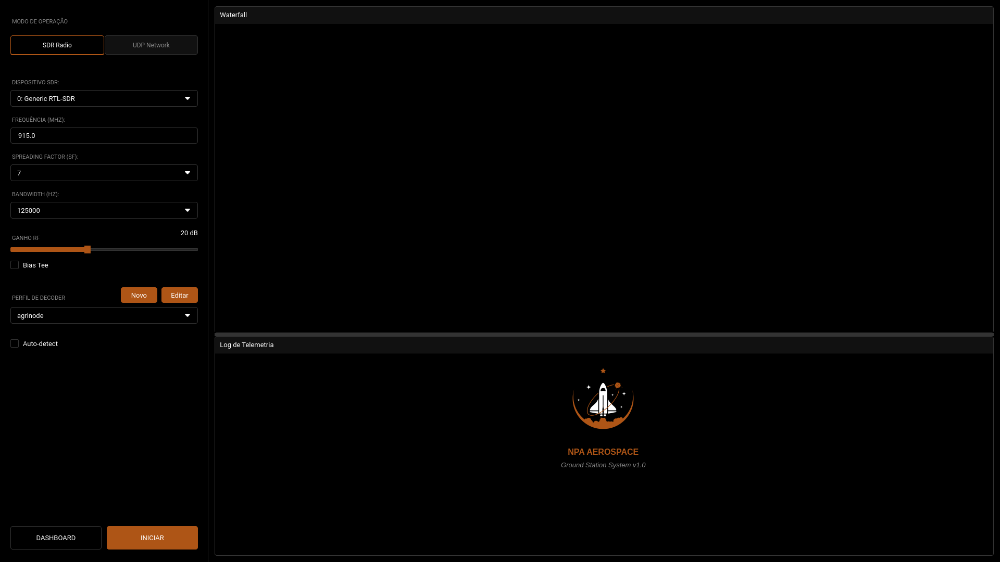

### 4.2 Sidebar de Configuração

A sidebar lateral esquerda contém todos os controles de configuração do sistema.

#### 4.2.1 Seletor de Modo de Operação

Permite alternar entre os modos SDR Radio e UDP Network.

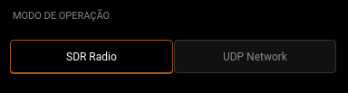

#### 4.2.2 Parâmetros SDR Radio (Apenas Linux)

Configurações disponíveis quando o modo SDR Radio está selecionado:

| Parâmetro | Descrição | Valores Típicos |
|-----------|-----------|------------------|
| Dispositivo SDR | Rádio SDR conectado | RTL-SDR, HackRF, Airspy |
| Frequência (MHz) | Frequência central de recepção LoRa | 915.0, 868.0, 433.0 |
| Spreading Factor | Fator de espalhamento LoRa | 7 a 12 |
| Bandwidth (Hz) | Largura de banda LoRa | 125000, 250000, 500000 |
| Ganho RF (dB) | Ganho do receptor | 0 a 49 |
| Bias Tee | Alimentação para LNA externo | Ativado/Desativado |

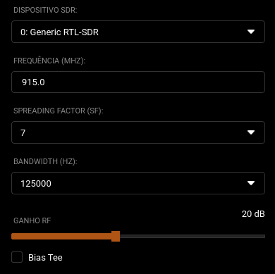

#### 4.2.3 Parâmetros UDP Network

Configurações disponíveis quando o modo UDP Network está selecionado:

| Parâmetro | Descrição | Valor Padrão |
|-----------|-----------|---------------|
| Host / IP | Endereço para escuta | 0.0.0.0 |
| Porta UDP | Porta de recepção | 5005 |

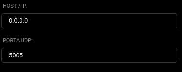

#### 4.2.4 Seletor de Decoder

Permite selecionar o perfil de decoder para interpretação dos pacotes LoRa recebidos. O sistema suporta **seleção múltipla de decoders** para operação com Multi-Decoder.

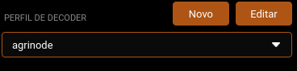

| Elemento | Função |
|----------|--------|
| Lista de Decoders | Seleção única ou múltipla de decoders ativos |
| Botão "Novo" | Abre o editor para criar novo decoder |
| Botão "Editar" | Abre o editor com o decoder selecionado |

**Modo Multi-Decoder:**

Quando múltiplos decoders são selecionados, o sistema:
- Seleciona automaticamente o decoder mais apropriado baseado no tamanho do payload
- Verifica sync_word e constraints de tamanho
- Tenta todos os decoders em caso de falha na seleção automática

#### 4.2.5 Botões de Ação


| Botão | Função |
|-------|--------|
| DASHBOARD | Navega para a tela de visualização de dados |
| INICIAR | Inicia a recepção de dados LoRa |
| PARAR | Interrompe a recepção (exibido durante operação) |

### 4.3 Área Principal

#### 4.3.1 Waterfall (Espectro de RF)

O waterfall exibe o espectro de radiofrequência em tempo real, disponível apenas no modo SDR Radio.

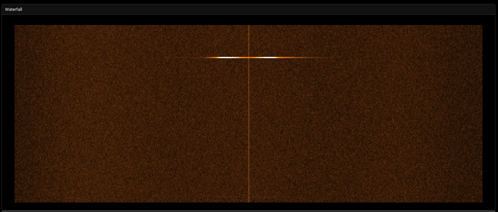

| Eixo | Representação |
|------|---------------|
| Horizontal | Frequência |
| Vertical | Tempo (mais recente na parte inferior) |
| Cor | Intensidade do sinal (escuro = fraco, claro = forte) |

#### 4.3.2 Log de Telemetria

Exibe os pacotes LoRa recebidos e decodificados em formato textual.

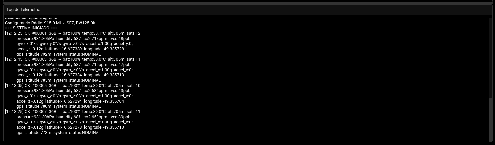

Formato das mensagens de log:

| Campo | Descrição |
|-------|-----------|
| Timestamp | Horário de recepção (HH:MM:SS) |
| PKT # | Número sequencial do pacote |
| Tamanho | Tamanho do pacote em bytes |
| Dados | Campos decodificados com valores |

### 4.4 Procedimento de Operação

#### 4.4.1 Iniciando a Recepção

1. Selecione o modo de operação (SDR Radio ou UDP Network)
2. Configure os parâmetros correspondentes ao modo selecionado
3. Selecione o decoder apropriado para o dispositivo transmissor
4. Clique no botão "INICIAR"
5. Observe o log de telemetria para confirmar recepção de pacotes

#### 4.4.2 Parando a Recepção

1. Clique no botão "PARAR"
2. Aguarde a confirmação no log de sistema
3. Um resumo da sessão será exibido com estatísticas

---

## 5. Dashboard de Telemetria

O Dashboard é a interface de visualização de dados em tempo real, construída dinamicamente com base no decoder selecionado.

### 5.1 Visão Geral

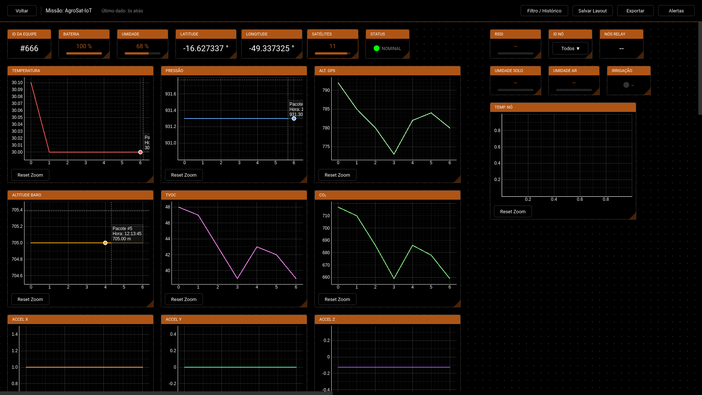

### 5.2 Barra Superior

A barra superior do dashboard contém controles de navegação e ações.

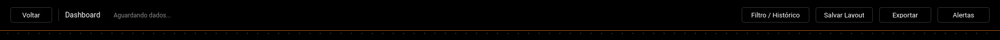

| Elemento | Função |
|----------|--------|
| Botão "Voltar" | Retorna à tela principal |
| Título da Missão | Nome do decoder/missão atual |
| Status de Recepção | Tempo desde o último pacote recebido |
| Botão "Filtro / Histórico" | Abre diálogo de carregamento de dados históricos |
| Botão "Salvar Layout" | Persiste a organização atual dos widgets |
| Botão "Exportar" | Abre diálogo de exportação de dados |
| Botão "Alertas" | Abre configuração do sistema de alertas |

### 5.3 Tipos de Widgets

O dashboard suporta diversos tipos de widgets para visualização de dados. O tipo de widget é definido no arquivo YAML do decoder através da propriedade `widget`.

#### 5.3.1 Plot (Gráfico de Linha)

Exibe o histórico de valores de um campo em formato de gráfico de linha interativo.

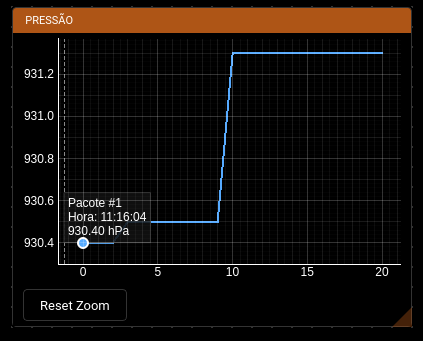

**Interações disponíveis:**

| Ação | Resultado |
|------|-----------|
| Movimento do mouse | Crosshair exibe valor do ponto |
| Clique esquerdo | Fixa um ponto com marcador |
| Clique direito | Copia valor para área de transferência |
| Scroll do mouse | Zoom in/out |
| Arrastar | Pan (deslocamento da visualização) |
| Botão "Reset Zoom" | Restaura visualização automática |

**Configuração YAML:**
```yaml
- name: "temperature"
  type: "int16be"
  scale: 0.1
  unit: "C"
  widget: "plot"
  plot_color: "#FF5555"
```

#### 5.3.2 Gauge (Medidor)

Exibe um valor numérico com barra de progresso, ideal para valores percentuais ou com faixa definida.

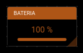

**Configuração YAML:**
```yaml
- name: "battery"
  type: "uint8"
  unit: "%"
  widget: "gauge"
  min: 0
  max: 100
```

#### 5.3.3 Card (Cartão)

Exibe um valor simples com unidade, adequado para leituras pontuais.

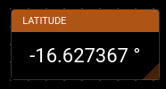

**Configuração YAML:**
```yaml
- name: "latitude"
  type: "int32be"
  scale: 0.0000001
  unit: "deg"
  widget: "card"
  format: "{:.6f}"
```

#### 5.3.4 LED (Indicador de Status)

Exibe um indicador colorido com mapeamento de valores para estados textuais.

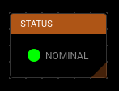

**Configuração YAML:**
```yaml
- name: "system_status"
  type: "uint8"
  widget: "led"
  mapping:
    0: "NOMINAL"
    1: "ALERTA"
    2: "CRITICO"
  colors:
    0: "#00FF00"
    1: "#FFAA00"
    2: "#FF0000"
```

#### 5.3.5 Map (Mapa GPS)

Exibe um mapa interativo com trajetória e posição atual do dispositivo.

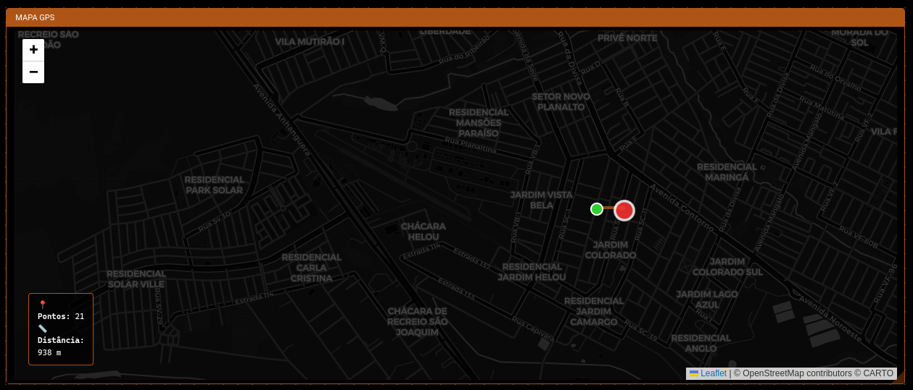

**Elementos do mapa:**

| Elemento | Descrição |
|----------|-----------|
| Marcador verde | Ponto inicial da trajetória |
| Marcador vermelho | Posição atual (com animação de pulso) |
| Linha de trajetória | Caminho percorrido |
| Painel de informações | Contagem de pontos e distância total |

**Configuração YAML:**
```yaml
- name: "gps_map"
  type: "virtual"
  widget: "map"
  lat_source: "latitude"
  lon_source: "longitude"
```

#### 5.3.6 Vario (Variômetro)

Exibe indicador de velocidade vertical com setas direcionais coloridas. Ideal para monitorar taxa de subida/descida.

**Indicações visuais:**

| Direção | Cor | Significado |
|---------|-----|-------------|
| Seta para cima | Verde | Subindo |
| Seta para baixo | Vermelho | Descendo |
| Traço horizontal | Amarelo | Estável |

**Configuração YAML:**
```yaml
- name: "vertical_speed"
  type: "int16be"
  scale: 0.1
  unit: "m/s"
  widget: "vario"
```

#### 5.3.7 Compass (Bússola)

Exibe indicador de direção com ponto cardinal e valor em graus. Útil para monitorar orientação do dispositivo.

**Elementos exibidos:**

| Elemento | Descrição |
|----------|-----------|
| Valor em graus | Direção numérica (0-360°) |
| Ponto cardinal | N, NE, E, SE, S, SW, W, NW |
| Indicador visual | Seta apontando a direção |

**Configuração YAML:**
```yaml
- name: "heading"
  type: "uint16be"
  unit: "deg"
  widget: "compass"
```

**Configuração YAML:**
```yaml
- name: "device_selector"
  type: "virtual"
  widget: "node_selector"
```

### 5.4 Manipulação de Widgets

#### 5.4.1 Movendo Widgets

1. Posicione o cursor sobre a barra de título do widget
2. Clique e mantenha pressionado o botão esquerdo do mouse
3. Arraste para a posição desejada
4. Solte o botão do mouse

#### 5.4.2 Redimensionando Widgets

1. Posicione o cursor sobre a borda do widget
2. O cursor mudará para indicar redimensionamento
3. Clique e arraste para o tamanho desejado
4. Solte o botão do mouse

#### 5.4.3 Salvando Layout

1. Organize os widgets conforme desejado
2. Clique no botão "Salvar Layout" na barra superior
3. O layout será restaurado automaticamente na próxima sessão com o mesmo decoder

---

## 6. Editor de Decoders

O Editor permite criar e modificar arquivos de configuração de decoder no formato YAML.

### 6.1 Acessando o Editor

**Para criar um novo decoder:**
1. Na tela principal, clique no botão "Novo" na seção de decoder
2. O editor será aberto em modo de criação

**Para editar um decoder existente:**
1. Selecione o decoder desejado no dropdown
2. Clique no botão "Editar"
3. O editor será aberto com o conteúdo do arquivo

### 6.2 Interface do Editor

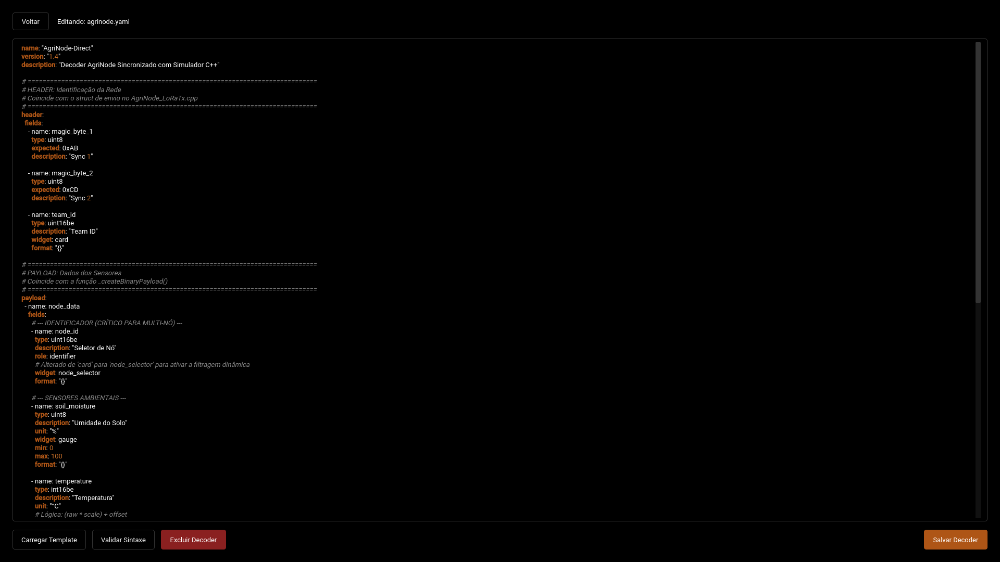

### 6.3 Elementos da Interface

| Elemento | Função |
|----------|--------|
| Botão "Voltar" | Retorna à tela principal |
| Campo "Nome do Arquivo" | Define o nome do arquivo (apenas para novos decoders) |
| Área de edição | Editor de texto com syntax highlighting |
| Botão "Carregar Template" | Insere modelo básico de decoder |
| Botão "Validar Sintaxe" | Verifica erros de sintaxe YAML |
| Botão "Excluir Decoder" | Remove o decoder (apenas em modo de edição) |
| Botão "Salvar Decoder" | Salva o arquivo |

### 6.4 Syntax Highlighting

O editor possui destaque de sintaxe para YAML:

| Elemento | Cor |
|----------|-----|
| Chaves | Laranja |
| Comentários | Cinza itálico |
| Números | Laranja claro |

### 6.5 Validação de Sintaxe

Antes de salvar, utilize a função de validação:

1. Clique no botão "Validar Sintaxe"
2. Aguarde o resultado:
   - Sucesso: "Sintaxe YAML correta!"
   - Erro: Mensagem indicando a linha e tipo de erro

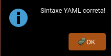

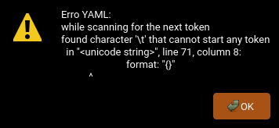

### 6.6 Template Padrão

O template padrão fornece uma estrutura básica para novos decoders:

```yaml
# Decoder Configuration
name: novo_decoder
version: "1.0"
description: "Descrição do decoder"

header:
  fields:
    - name: sync_word
      type: uint16be
      expected: 0xABCD

payload:
  - name: sensor_data
    fields:
      - name: temperature
        type: int16be
        scale: 0.1
        unit: "C"
        widget: plot
        
      - name: humidity
        type: uint8
        unit: "%"
        widget: gauge
        min: 0
        max: 100
```

---

## 7. Sistema de Alertas

O sistema de alertas permite configurar notificações automáticas quando valores de telemetria ultrapassam limites definidos pelo usuário.

### 7.1 Acessando a Configuração

1. No Dashboard, clique no botão "Alertas" na barra superior
2. O diálogo de configuração será aberto

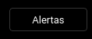

### 7.2 Diálogo de Configuração

O diálogo possui duas abas: Configuração e Histórico.

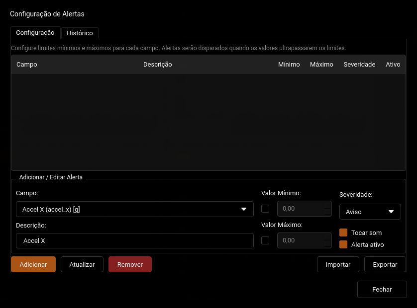

#### 7.2.1 Aba Configuração

Permite adicionar, editar e remover configurações de alertas.

**Tabela de alertas configurados:**

| Coluna | Descrição |
|--------|-----------|
| Campo | Nome do campo monitorado |
| Descrição | Descrição amigável do alerta |
| Mínimo | Valor mínimo (abaixo dispara alerta) |
| Máximo | Valor máximo (acima dispara alerta) |
| Severidade | Nível de criticidade |
| Ativo | Estado de ativação |

**Formulário de edição:**

| Campo | Descrição |
|-------|-----------|
| Campo | Seleção do campo de telemetria |
| Descrição | Texto descritivo do alerta |
| Valor Mínimo | Limite inferior (opcional) |
| Valor Máximo | Limite superior (opcional) |
| Severidade | Informação, Aviso ou Crítico |
| Tocar som | Habilita alerta sonoro |
| Alerta ativo | Habilita/desabilita o alerta |

#### 7.2.2 Aba Histórico

Exibe o registro de todos os alertas disparados durante a sessão.

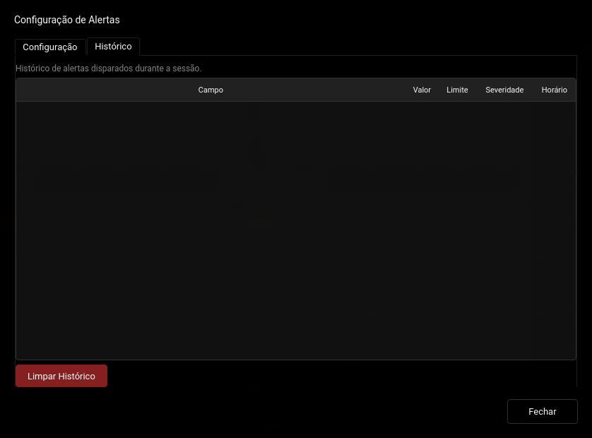

| Coluna | Descrição |
|--------|-----------|
| Campo | Campo que disparou o alerta |
| Valor | Valor que causou a violação |
| Limite | Limite que foi ultrapassado |
| Severidade | Nível de criticidade |
| Horário | Momento do disparo |

### 7.3 Criando um Alerta

**Procedimento:**

1. Abra o diálogo de alertas
2. Na seção "Adicionar / Editar Alerta":
   - Selecione o campo no dropdown
   - Digite uma descrição (opcional)
   - Marque e defina o valor mínimo e/ou máximo
   - Selecione a severidade
   - Configure as opções de som e ativação
3. Clique no botão "Adicionar"

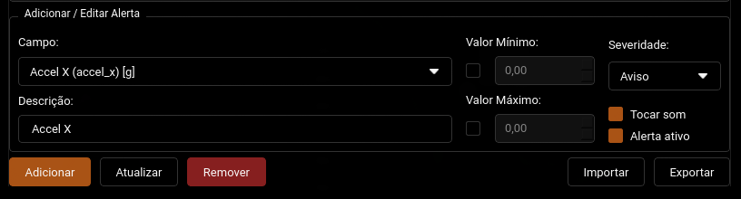

### 7.4 Níveis de Severidade

| Severidade | Descrição | Indicação Visual |
|------------|-----------|------------------|
| Informação | Apenas informativo | Borda azul |
| Aviso | Atenção necessária | Borda amarela |
| Crítico | Ação imediata requerida | Borda vermelha |

### 7.5 Notificações

Quando um alerta é disparado, uma notificação aparece no canto superior direito do dashboard.

**Comportamento das notificações:**

- Aparecem no canto superior direito
- Desaparecem automaticamente após 6 segundos
- Clique para fechar imediatamente
- Múltiplas notificações são empilhadas verticalmente
- A cor da borda indica a severidade

### 7.6 Indicador de Alertas Ativos

O botão "Alertas" na barra superior muda de cor quando há alertas ativos:

| Estado | Cor do Botão |
|--------|-------------|
| Sem alertas ativos | Cinza (padrão) |
| Alertas ativos | Vermelho |


### 7.7 Importação e Exportação

**Exportar configurações:**

1. Configure os alertas desejados
2. Clique no botão "Exportar"
3. Selecione o local e nome do arquivo JSON

**Importar configurações:**

1. Clique no botão "Importar"
2. Selecione um arquivo JSON de configuração
3. Os alertas serão carregados

---

## 8. Exportação de Dados

O sistema permite exportar dados de telemetria coletados para análise externa.

### 8.1 Acessando a Exportação

1. No Dashboard, clique no botão "Exportar" na barra superior
2. O diálogo de exportação será aberto

### 8.2 Diálogo de Exportação

O diálogo possui três abas para configuração detalhada.

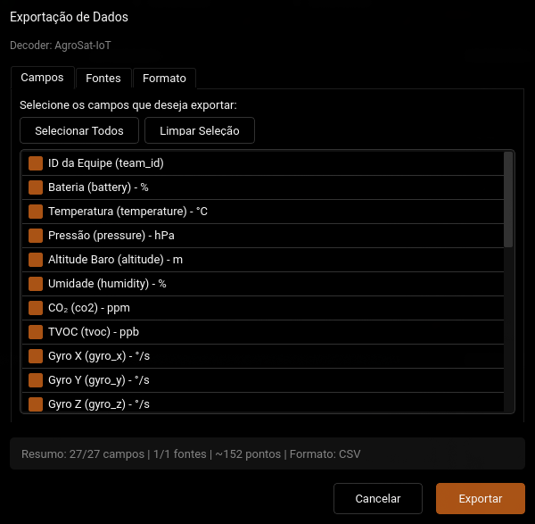

#### 8.2.1 Aba Campos

Permite selecionar quais campos de telemetria serão exportados.

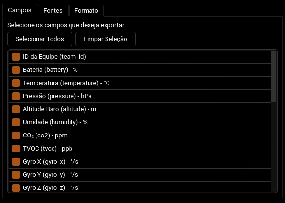

| Elemento | Função |
|----------|--------|
| Lista de campos | Seleção múltipla de campos |
| Botão "Selecionar Todos" | Marca todos os campos |
| Botão "Limpar Seleção" | Desmarca todos os campos |

#### 8.2.2 Aba Fontes

Permite selecionar as fontes de dados (dispositivos) e período.

| Elemento | Função |
|----------|--------|
| Lista de fontes | Seleção de dispositivos |
| Todos os dados | Exporta todo o buffer |
| Últimos N pontos | Limita quantidade de dados |

#### 8.2.3 Aba Formato

Permite configurar o formato de saída.

**Formato CSV:**

| Opção | Descrição |
|-------|-----------|
| Incluir cabeçalho | Nomes dos campos na primeira linha |
| Incluir metadados | Informações do decoder e data |
| Incluir coluna de índice | Numeração das linhas |
| Separador | Caractere separador (padrão: vírgula) |

**Formato JSON:**

| Opção | Descrição |
|-------|-----------|
| Formatação legível | Indentação para fácil leitura |
| Incluir configuração | Metadados dos campos |

### 8.3 Executando a Exportação

1. Configure campos, fontes e formato
2. Verifique o resumo na parte inferior do diálogo
3. Clique no botão "Exportar"
4. Selecione o local e nome do arquivo
5. Aguarde a confirmação de sucesso

### 8.4 Formato dos Arquivos Exportados

**Exemplo CSV:**
```csv
# Decoder: AgroSat-IoT
# Exportado em: 2024-01-15T14:32:00

index,temperature,pressure,altitude
0,23.5,1013.2,1250
1,23.6,1013.1,1248
2,23.7,1013.0,1245
```

**Exemplo JSON:**
```json
{
  "metadata": {
    "decoder": "AgroSat-IoT",
    "exported_at": "2024-01-15T14:32:00",
    "fields": ["temperature", "pressure", "altitude"]
  },
  "data": {
    "_satellite": {
      "temperature": [23.5, 23.6, 23.7],
      "pressure": [1013.2, 1013.1, 1013.0],
      "altitude": [1250, 1248, 1245]
    }
  }
}
```

---

## 9. Geração de Relatórios

O sistema permite gerar relatórios profissionais em PDF com análise completa dos dados de telemetria coletados. Os relatórios seguem padrões de documentação técnica com capa profissional, KPIs destacados e visualizações de alta qualidade.

### 9.1 Acessando o Gerador de Relatórios

1. No Dashboard, clique no botão "Relatório" na barra superior
2. O diálogo de geração de relatórios será aberto

> **Nota:** O gerador de relatórios é independente - você pode gerar relatórios mesmo sem uma sessão ativa, carregando dados do histórico.

### 9.2 Diálogo de Geração de Relatórios

O diálogo possui quatro abas para configuração detalhada.

#### 9.2.1 Aba Fonte de Dados

Permite selecionar o decoder e período dos dados.

| Elemento | Função |
|----------|--------|
| Decoder | Seleciona qual decoder será usado para interpretar os dados |
| Período | Define intervalo de tempo (De/Até) |
| Botões rápidos | Atalhos para períodos comuns (1h, 6h, 12h, 24h, 7d) |
| Botão "Carregar Dados" | Carrega dados do histórico para o período selecionado |
| Árvore de dados | Exibe dados carregados em estrutura hierárquica |

**Estrutura da Árvore de Dados:**

A árvore organiza os dados por fonte (dispositivo):

```
☑ Principal
  ☑ temperature (251 pontos)
  ☑ pressure (251 pontos)
  ☑ altitude (251 pontos)
☑ Node 1000
  ☑ humidity (45 pontos)
  ☑ soil_temp (45 pontos)
```

Cada item pode ser marcado/desmarcado individualmente para incluir ou excluir do relatório.

#### 9.2.2 Aba Informações

Permite configurar metadados do relatório.

| Campo | Descrição |
|-------|-----------|
| Título do Relatório | Título que aparece na capa do PDF |
| Nome da Missão | Identificação da missão/operação |
| Autor | Nome do responsável pelo relatório |
| Organização | Nome da organização (padrão: NPA - Núcleo de Pesquisas Aeroespaciais - UFG) |
| Tamanho da Página | A4 ou Carta (Letter) |
| Orientação | Retrato ou Paisagem |

#### 9.2.3 Aba Seções

Permite selecionar quais seções serão incluídas no relatório.

| Seção | Descrição |
|-------|-----------|
| Resumo Executivo | Visão geral da missão com KPIs destacados (duração, fontes, campos, alertas) |
| Estatísticas de Telemetria | Tabela completa com N, mín, máx, média, desvio padrão (σ), mediana |
| Gráficos Temporais | Gráficos profissionais com linhas de referência (média, mín, máx) |
| Registro de Alertas | Lista de alertas disparados com severidade colorida |
| Trajetória GPS (Mapa) | Mapa real do OpenStreetMap com trajetória e marcadores |
| Configuração e Metadados | Apêndice com informações sobre a configuração do relatório |

#### 9.2.4 Aba Gráficos

Permite configurar quais campos terão gráficos e o estilo visual.

**Estilo dos Gráficos:**

| Estilo | Descrição |
|--------|-----------|
| Linha | Gráfico de linha contínua com linhas de referência |
| Dispersão (Scatter) | Pontos individuais |
| Área | Linha com preenchimento |

**Qualidade:**

| Qualidade | DPI | Uso Recomendado |
|-----------|-----|------------------|
| Baixa | 80 | Visualização rápida, arquivo menor |
| Média | 120 | Uso geral (recomendado) |
| Alta | 150 | Impressão de alta qualidade |

### 9.3 Gerando o Relatório

**Procedimento:**

1. Selecione o decoder na aba "Fonte de Dados"
2. Defina o período desejado
3. Clique em "Carregar Dados"
4. Selecione os campos desejados na árvore
5. Configure as informações na aba "Informações"
6. Marque as seções desejadas na aba "Seções"
7. Configure os gráficos na aba "Gráficos"
8. Clique em "Gerar Relatório"
9. Escolha o local e nome do arquivo PDF
10. Aguarde a geração (barra de progresso será exibida)

### 9.4 Estrutura do Relatório PDF

O relatório gerado possui a seguinte estrutura profissional:

#### 1. Capa
- Logo NPA-UFG centralizada
- Título do relatório em destaque
- Nome da missão
- Informações: período, duração, decoders, autor, organização
- Data de geração
- Aviso de confidencialidade

#### 2. Resumo Executivo
- **KPIs em destaque**: Cards coloridos com duração, fontes, campos e alertas
- **Tabela de visão geral**: Métricas principais com observações
- **Destaques da telemetria**: Variações significativas detectadas automaticamente

#### 3. Estatísticas de Telemetria
- **Tabela principal**: Campo, N, Mín, Máx, Média, σ (desvio padrão), Mediana, Unidade
- **Análise de variação**: Valor inicial, final, variação absoluta e percentual, tendência (↑/↓/→)

#### 4. Gráficos Temporais
- Gráficos profissionais com fundo claro
- Linhas de referência: média (tracejada), máximo e mínimo (pontilhadas)
- Legenda com valores
- Numeração de figuras

#### 5. Trajetória GPS
- Mapa real do OpenStreetMap (quando disponível)
- Linha de trajetória em laranja (cor NPA)
- Marcador verde (início) e vermelho (fim)
- Tabela com estatísticas de posição

#### 6. Registro de Alertas
- Resumo por severidade (críticos, avisos, informativos)
- Tabela com data/hora, campo, valor, limite e severidade
- Cores indicativas por severidade

#### 7. Apêndice: Configuração
- Parâmetros utilizados na geração
- Seções incluídas
- Informações de rastreabilidade

### 9.5 Cabeçalho e Rodapé

Todas as páginas (exceto a capa) possuem:

- **Cabeçalho**: Título do relatório, nome da missão e data
- **Rodapé**: "NPA Ground Station", número da página e "Documento Confidencial"

### 9.6 Paleta de Cores

O relatório utiliza a paleta oficial NPA:

| Elemento | Cor | Uso |
|----------|-----|-----|
| Primária | #ae5516 (Laranja) | Títulos, destaques, linhas decorativas |
| Secundária | #1a365d (Azul escuro) | Cabeçalhos de tabelas, subtítulos |
| Sucesso | #38a169 (Verde) | Indicadores positivos, marcador de início |
| Aviso | #d69e2e (Amarelo) | Alertas de aviso |
| Perigo | #e53e3e (Vermelho) | Alertas críticos, marcador de fim |

### 9.7 Mapa de Trajetória GPS

Quando a opção "Trajetória GPS (Mapa)" está marcada e existem dados de latitude/longitude:

- **Mapa real do OpenStreetMap** com tiles baixados automaticamente
- **Linha de trajetória** em laranja (cor NPA) sobre o mapa
- **Marcador de início** (círculo verde)
- **Marcador de fim** (círculo vermelho)
- **Tabela de estatísticas** com coordenadas iniciais, finais e range

> **Nota:** O sistema busca automaticamente campos de GPS com nomes como `latitude`, `lat`, `gps_lat`, `longitude`, `lon`, `gps_lon`.

> **Fallback:** Se o mapa não puder ser gerado (sem internet ou biblioteca), um gráfico de trajetória simples será incluído.

### 9.8 Estatísticas Disponíveis

A seção de estatísticas de telemetria inclui:

| Estatística | Símbolo | Descrição |
|-------------|---------|------------|
| Contagem | N | Número total de amostras |
| Mínimo | Mín | Menor valor registrado |
| Máximo | Máx | Maior valor registrado |
| Média | Média | Valor médio aritmético |
| Desvio Padrão | σ | Dispersão dos valores em torno da média |
| Mediana | Mediana | Valor central (50º percentil) |

### 9.9 Dicas para Relatórios de Qualidade

1. **Carregue dados suficientes**: Relatórios com mais pontos geram estatísticas mais confiáveis
2. **Use qualidade "Alta"** para impressão ou apresentações
3. **Selecione campos relevantes**: Evite incluir campos técnicos desnecessários
4. **Preencha as informações**: Título, missão e autor aparecem na capa
5. **Verifique dados GPS**: Para mapas, certifique-se de ter coordenadas válidas

---

## 10. Histórico e Filtros

O sistema permite carregar e analisar dados de sessões anteriores.

### 10.1 Acessando o Histórico

1. No Dashboard, clique no botão "Filtro / Histórico" na barra superior
2. O diálogo de filtro será aberto

### 10.2 Opções de Filtro

| Opção | Descrição |
|-------|-----------|
| Esquema de Visualização | Decoder para interpretar os dados |
| Início | Data e hora inicial do período |
| Fim | Data e hora final do período |
| Botões rápidos | Atalhos para períodos comuns (1h, 6h, 12h, 24h, Tudo) |
| Limite de pacotes | Número máximo de pacotes a carregar |
| Limpar gráficos | Remove dados existentes antes de carregar |

### 10.3 Carregando Dados Históricos

**Procedimento:**

1. Selecione o decoder apropriado
2. Defina o intervalo de tempo desejado
3. Configure o limite de pacotes (0 para sem limite)
4. Marque "Limpar gráficos atuais" se desejar substituir os dados
5. Clique no botão "Filtrar"
6. Aguarde o carregamento (indicador de progresso será exibido)

### 10.4 Arquivo de Log

Os dados de telemetria são salvos automaticamente em:

```
~/.local/share/npags/logs/station_data.jsonl
```
(Windows: `%APPDATA%/npags/logs/station_data.jsonl`)

Formato do arquivo (JSON Lines):
```json
{"ts": "2024-01-15T14:32:15.123", "id": 1, "raw": "ABCD...", "data": {...}}
{"ts": "2024-01-15T14:32:16.456", "id": 2, "raw": "ABCD...", "data": {...}}
```

---

## 11. Configuração de Decoders YAML

Esta seção detalha a estrutura e opções de configuração dos arquivos de decoder.

### 11.1 Localização dos Arquivos

Os arquivos de decoder são carregados de duas fontes:

**Schemas embutidos (somente leitura):**
Diretório interno do pacote, contém os decoders que acompanham o programa.

**Decoders do usuário (persistente):**
```
~/.local/share/npags/decoders/
```
(Windows: `%APPDATA%/npags/decoders/`)

Decoders criados ou editados pelo usuário são salvos neste diretório
e persistem entre execuções. Se um decoder do usuário tiver o mesmo
nome de um schema embutido, o decoder do usuário tem prioridade.

### 11.2 Estrutura Geral

Um arquivo de decoder possui as seguintes seções principais:

```yaml
name: "NomeDoDecoder"
version: "1.0.0"
description: "Descrição do propósito do decoder"

header:
  fields:
    - name: "sync_word"
      type: "uint16be"
      expected: 0xABCD

payload:
  - name: "sensor_data"
    fields:
      - name: "temperature"
        type: "int16be"
        scale: 0.1
        unit: "C"
        widget: "plot"
```

### 11.3 Seção de Metadados

```yaml
name: "NomeDoDecoder"
version: "1.0.0"
description: "Descrição do propósito do decoder"
author: "Nome do Autor"
```

| Campo | Obrigatório | Descrição |
|-------|-------------|------------|
| name | Sim | Identificador único do decoder |
| version | Não | Versão do decoder |
| description | Não | Descrição textual |
| author | Não | Autor do decoder |

### 11.4 Seção Meta

```yaml
meta:
  endian: "big"
  min_size: 36
  has_crc: true
  crc_size: 2
```

| Campo | Valores | Descrição |
|-------|---------|------------|
| endian | "big", "little" | Ordem dos bytes |
| min_size | Inteiro | Tamanho mínimo do pacote em bytes |
| has_crc | true, false | Indica presença de CRC |
| crc_size | Inteiro | Tamanho do CRC em bytes |

### 11.5 Seção Header

Define os campos de cabeçalho do pacote, utilizados para validação.

```yaml
header:
  fields:
    - name: "sync_word"
      type: "uint16be"
      expected: 0xABCD
      description: "Palavra de sincronização"
```

| Propriedade | Descrição |
|-------------|-----------|
| expected | Valor esperado para validação (pacote rejeitado se diferente) |

### 11.6 Seção Payload

Define as seções de dados do pacote.

```yaml
payload:
  - name: "sensor_data"
    fields:
      - name: "temperature"
        type: "int16be"
        scale: 0.1
        unit: "C"
        widget: "plot"
```

#### Propriedades de Seção

| Propriedade | Tipo | Descrição |
|-------------|------|------------|
| name | string | Nome da seção |
| fields | lista | Lista de campos |
| optional | boolean | Seção opcional |
| condition | string | Condição para processamento |
| is_array | boolean | Indica seção com múltiplos itens |
| count_field | string | Campo que define quantidade de itens |

#### Seções Condicionais

Você pode criar seções que só são processadas quando uma condição é atendida:

```yaml
- name: "extended_data"
  optional: true
  condition: "payload_size > 36"
  fields:
    - name: "extra_field"
      type: "uint16be"
```

**Operadores suportados em condições:**

| Operador | Descrição |
|----------|-----------|
| > | Maior que |
| >= | Maior ou igual |
| < | Menor que |
| <= | Menor ou igual |
| == | Igual |
| != | Diferente |

#### Seções de Array

```yaml
- name: "relay_nodes"
  is_array: true
  count_field: "header.node_count"
  fields:
    - name: "node_id"
      type: "uint16be"
```

### 11.7 Tipos de Dados

| Tipo | Tamanho | Descrição | Faixa |
|------|---------|-----------|-------|
| uint8 | 1 byte | Inteiro sem sinal | 0 a 255 |
| int8 | 1 byte | Inteiro com sinal | -128 a 127 |
| uint16be | 2 bytes | Inteiro sem sinal, Big Endian | 0 a 65535 |
| int16be | 2 bytes | Inteiro com sinal, Big Endian | -32768 a 32767 |
| uint32be | 4 bytes | Inteiro sem sinal, Big Endian | 0 a 4294967295 |
| int32be | 4 bytes | Inteiro com sinal, Big Endian | -2147483648 a 2147483647 |
| float32be | 4 bytes | Ponto flutuante, Big Endian | IEEE 754 |
| virtual | 0 bytes | Campo virtual (não lê bytes) | - |

### 11.8 Propriedades de Campo

#### Propriedades Básicas

| Propriedade | Tipo | Obrigatório | Descrição |
|-------------|------|-------------|------------|
| name | string | Sim | Nome único do campo |
| type | string | Sim | Tipo de dado |
| description | string | Não | Descrição amigável |
| unit | string | Não | Unidade de medida |

#### Transformações

| Propriedade | Tipo | Descrição |
|-------------|------|------------|
| scale | float | Multiplicador aplicado ao valor |
| offset | float | Valor adicionado após scale |

Fórmula de transformação:
```
valor_final = (valor_raw * scale) + offset
```

Exemplo:
```yaml
- name: "temperature"
  type: "int16be"
  scale: 0.1
  offset: -50.0
  # valor_raw = 750
  # valor_final = (750 * 0.1) + (-50.0) = 25.0
```

#### Propriedades de Widget

| Propriedade | Tipo | Descrição |
|-------------|------|------------|
| widget | string | Tipo de widget para visualização |
| plot_color | string | Cor do gráfico (formato hex) |
| min | float | Valor mínimo (gauge) |
| max | float | Valor máximo (gauge) |
| format | string | Formato de exibição |
| mapping | dict | Mapeamento valor para texto (LED) |
| colors | dict | Mapeamento valor para cor (LED) |
| lat_source | string | Campo de latitude (map) |
| lon_source | string | Campo de longitude (map) |

#### Tipos de Widget

| Widget | Descrição | Propriedades Específicas |
|--------|-----------|-------------------------|
| none | Não exibe | - |
| card | Valor simples | format |
| gauge | Barra de progresso | min, max |
| plot | Gráfico de linha | plot_color |
| led | Indicador de status | mapping, colors |
| map | Mapa GPS | lat_source, lon_source |
| vario | Variômetro (velocidade vertical) | - |
| compass | Bússola (direção) | - |
| node_selector | Seletor de dispositivo | - |

### 11.9 Exemplos de Configuração

#### Campo com Gráfico

```yaml
- name: "temperature"
  type: "int16be"
  scale: 0.1
  offset: -50.0
  unit: "C"
  description: "Temperatura"
  widget: "plot"
  plot_color: "#FF5555"
```

#### Campo com Gauge

```yaml
- name: "battery"
  type: "uint8"
  unit: "%"
  description: "Nível de Bateria"
  widget: "gauge"
  min: 0
  max: 100
```

#### Campo com LED

```yaml
- name: "system_status"
  type: "uint8"
  description: "Status do Sistema"
  widget: "led"
  mapping:
    0: "NOMINAL"
    1: "ALERTA"
    2: "CRITICO"
    3: "OFFLINE"
  colors:
    0: "#00FF00"
    1: "#FFAA00"
    2: "#FF0000"
    3: "#555555"
```

#### Mapa GPS

```yaml
- name: "latitude"
  type: "int32be"
  scale: 0.0000001
  unit: "deg"
  description: "Latitude"
  widget: "card"
  format: "{:.6f}"

- name: "longitude"
  type: "int32be"
  scale: 0.0000001
  unit: "deg"
  description: "Longitude"
  widget: "card"
  format: "{:.6f}"

- name: "gps_map"
  type: "virtual"
  widget: "map"
  description: "Mapa GPS"
  lat_source: "latitude"
  lon_source: "longitude"
```

#### Variômetro

```yaml
- name: "vertical_speed"
  type: "int16be"
  scale: 0.1
  unit: "m/s"
  description: "Velocidade Vertical"
  widget: "vario"
```

#### Bússola

```yaml
- name: "heading"
  type: "uint16be"
  unit: "deg"
  description: "Direção"
  widget: "compass"
```

### 11.10 Exemplo Completo de Decoder

Abaixo está um exemplo completo de um decoder para um dispositivo de telemetria:

```yaml
# Decoder para dispositivo AgroSat
name: "AgroSat-IoT"
version: "2.0.0"
description: "Decoder para sensores agrícolas AgroSat"
author: "NPA-UFG"

meta:
  endian: "big"
  min_size: 24
  has_crc: true
  crc_size: 2

header:
  fields:
    - name: "sync_word"
      type: "uint16be"
      expected: 0xABCD
      description: "Palavra de sincronização"
    
    - name: "packet_id"
      type: "uint16be"
      description: "ID do pacote"
      widget: "card"

payload:
  - name: "sensor_data"
    fields:
      - name: "temperature"
        type: "int16be"
        scale: 0.1
        unit: "°C"
        description: "Temperatura ambiente"
        widget: "plot"
        plot_color: "#FF5555"
      
      - name: "humidity"
        type: "uint8"
        unit: "%"
        description: "Umidade relativa"
        widget: "gauge"
        min: 0
        max: 100
      
      - name: "battery"
        type: "uint8"
        unit: "%"
        description: "Nível de bateria"
        widget: "gauge"
        min: 0
        max: 100
      
      - name: "status"
        type: "uint8"
        description: "Status do sistema"
        widget: "led"
        mapping:
          0: "OK"
          1: "ALERTA"
          2: "ERRO"
        colors:
          0: "#00FF00"
          1: "#FFAA00"
          2: "#FF0000"
  
  - name: "gps_data"
    fields:
      - name: "latitude"
        type: "int32be"
        scale: 0.0000001
        unit: "deg"
        widget: "card"
        format: "{:.6f}"
      
      - name: "longitude"
        type: "int32be"
        scale: 0.0000001
        unit: "deg"
        widget: "card"
        format: "{:.6f}"
      
      - name: "gps_map"
        type: "virtual"
        widget: "map"
        lat_source: "latitude"
        lon_source: "longitude"
```

---

## 12. Solução de Problemas

### 12.1 Problemas de Inicialização

#### O programa não inicia (Windows)

**Sintomas:** Nada acontece ao clicar no executável, ou aparece erro.

**Soluções:**

1. **Antivírus bloqueando:** Adicione uma exceção para a pasta do programa
2. **Execute como administrador:** Clique com botão direito → "Executar como administrador"
3. **Instale Visual C++ Redistributable:** Baixe de [aka.ms/vs/17/release/vc_redist.x64.exe](https://aka.ms/vs/17/release/vc_redist.x64.exe)

#### O programa não inicia (Linux)

**Sintomas:** Erro de permissão ou biblioteca não encontrada.

**Soluções:**

1. **Permissão de execução:**
   ```bash
   chmod +x NPA-GroundStation
   ```

2. **Verificar bibliotecas:**
   ```bash
   ldd NPA-GroundStation
   ```

3. **Instalar dependências Qt (se necessário):**
   ```bash
   # Ubuntu/Debian
   sudo apt install libqt6-dev
   
   # Arch Linux
   sudo pacman -S qt6-base
   ```

### 12.2 Problemas de Hardware SDR (Apenas Linux)

#### Dispositivo SDR não detectado

**Sintoma:** A lista de dispositivos mostra "Nenhum dispositivo encontrado".

**Soluções:**

1. Verifique a conexão USB do dispositivo
2. Execute o comando `lsusb` (Linux) para confirmar detecção pelo sistema
3. Instale os drivers necessários:

```bash
# Arch Linux
sudo pacman -S rtl-sdr

# Ubuntu/Debian
sudo apt install rtl-sdr
```

4. Configure regras udev para acesso sem privilégios de root:

```bash
sudo cp /usr/share/doc/rtl-sdr/rtl-sdr.rules /etc/udev/rules.d/
sudo udevadm control --reload-rules
```

5. Reconecte o dispositivo


### 12.3 Problemas de Decodificação

#### Mensagem "Header Inválido"

**Sintoma:** Pacotes são recebidos mas rejeitados com erro de header.

**Causas possíveis:**
- Decoder incorreto selecionado
- Frequência de recepção incorreta
- Parâmetros LoRa (SF, BW) não correspondem ao transmissor
- Ruído ou pacotes de outros dispositivos

**Soluções:**

1. Confirme que o decoder selecionado corresponde ao dispositivo transmissor
2. Verifique a frequência de recepção
3. Confirme os parâmetros LoRa com a documentação do transmissor
4. Ajuste o ganho do receptor

#### Mensagem "Payload incompleto (Buffer Underflow)"

**Sintoma:** Pacotes parcialmente decodificados.

**Causas possíveis:**
- Pacote corrompido durante transmissão
- Configuração `min_size` incorreta no decoder
- Interferência no canal de rádio

**Soluções:**

1. Verifique o valor de `min_size` no arquivo YAML do decoder
2. Ajuste o ganho do receptor
3. Verifique por fontes de interferência

### 12.4 Problemas de Interface

#### Mapa não exibe

**Sintoma:** Widget de mapa mostra apenas coordenadas em texto.

**Causa:** Sem conexão com internet para baixar tiles do mapa.

**Solução:** Verifique sua conexão com a internet.

#### Gráficos não atualizam

**Sintoma:** Widgets de gráfico permanecem vazios.

**Causas possíveis:**
- Campo não configurado com widget no decoder
- Dados não estão sendo recebidos

**Soluções:**

1. Verifique se o campo possui `widget: "plot"` no arquivo YAML
2. Confirme recepção de dados no log de telemetria

#### Interface com aparência incorreta

**Sintoma:** Fontes ou cores não correspondem ao esperado.

**Causa:** Tema do sistema operacional interferindo.

**Solução (Linux):**
```bash
QT_QPA_PLATFORMTHEME= ./NPA-GroundStation
```

### 12.5 Problemas com Relatórios

#### Erro ao gerar relatório PDF

**Sintoma:** Mensagem de erro ao clicar em "Gerar Relatório".

**Soluções:**

1. Verifique se há dados carregados na aba "Fonte de Dados"
2. Selecione pelo menos um campo na árvore de dados
3. Verifique se há espaço em disco suficiente

#### Mapa não aparece no relatório

**Causa:** Sem dados de GPS ou sem conexão com internet.

**Soluções:**

1. Verifique se existem campos de latitude/longitude nos dados
2. Verifique conexão com internet (necessária para baixar tiles)

### 12.6 Arquivos de Log

Os logs do sistema são armazenados em:

| Arquivo | Conteúdo |
|---------|-----------|
| ~/.local/share/npags/logs/station_data.jsonl | Dados de telemetria |

Para visualizar logs em tempo real (Linux):

```bash
tail -f ~/.local/share/npags/logs/station_data.jsonl
```

### 12.7 Teste com Pacotes UDP

Para testar o sistema sem hardware SDR:

1. Inicie o Ground Station em modo UDP (porta 5005)
2. Use um script ou ferramenta para enviar pacotes UDP de teste
3. Exemplo com netcat:
   ```bash
   echo -n -e '\xAB\xCD\x00\x01\x00\x64' | nc -u localhost 5005
   ```

### 12.8 Perguntas Frequentes (FAQ)

**P: Posso usar o sistema sem um rádio SDR?**

R: Sim! Use o modo UDP Network para receber dados de gateways LoRa externos ou para testes. No Windows, este é o único modo disponível.

**P: Por que o modo SDR não funciona no Windows?**

R: O modo SDR depende do GNU Radio, que é complexo de instalar no Windows. Recomendamos usar Linux para recepção SDR direta, ou configurar um gateway LoRa que envie dados via UDP para o Windows.

**P: Como faço para monitorar múltiplos dispositivos?**

R: Selecione múltiplos decoders na tela principal. O sistema detectará automaticamente qual decoder usar para cada pacote recebido.

**P: Os dados são salvos automaticamente?**

R: Sim, todos os pacotes recebidos são salvos em `~/.local/share/npags/logs/station_data.jsonl`. Você pode carregar dados históricos a qualquer momento.

**P: Posso personalizar as cores dos gráficos?**

R: Sim, use a propriedade `plot_color` no arquivo YAML do decoder com um código de cor hexadecimal (ex: `#FF5555`).

**P: O mapa precisa de internet?**

R: Sim, o mapa baixa tiles do OpenStreetMap. Sem internet, será exibido um fallback com coordenadas em texto.

---

## Suporte

Para suporte técnico ou dúvidas:

- **Repositório:** [github.com/npa-ufg/npags](https://github.com/npa-ufg/npags)
- **Issues:** [github.com/npa-ufg/npags/issues](https://github.com/npa-ufg/npags/issues)

### Reportando Problemas

Ao re